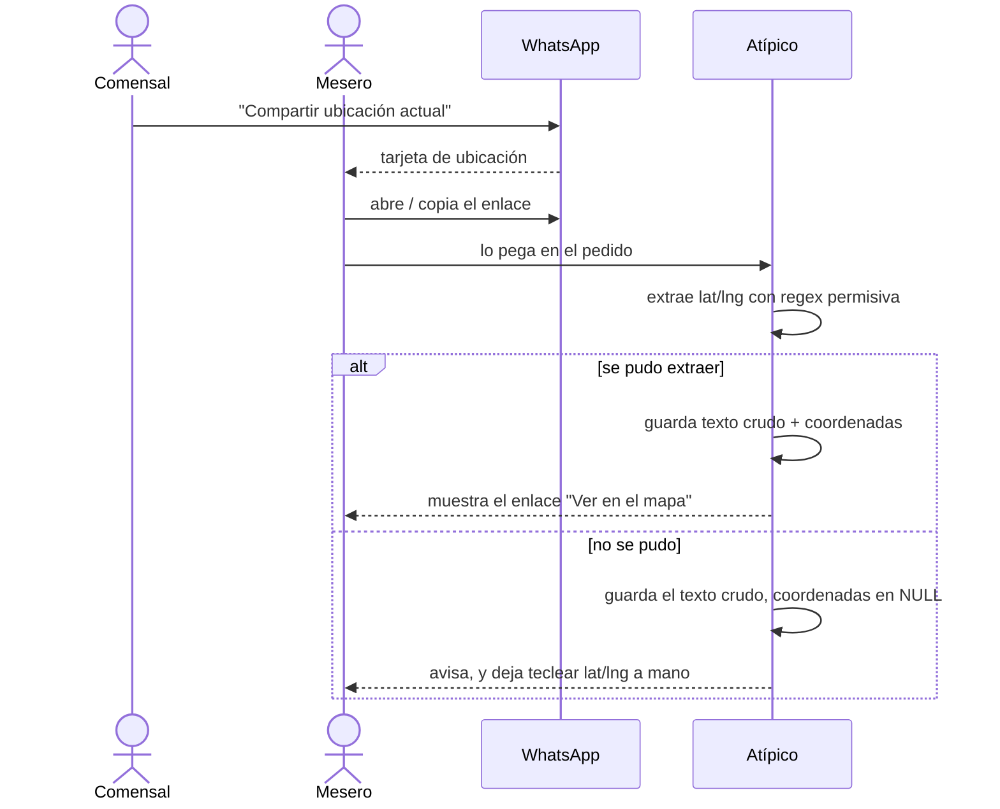

# Dirección de entrega para pedidos por delivery

Especificación funcional y técnica para registrar a dónde va un pedido `DELIVERY`. Continúa
[tipo-pedido.md](tipo-pedido.md), que dejó `DELIVERY` como una etiqueta sin datos operativos.

- **Estado:** **implementado**, compila y con pruebas en verde. Falta correr la migración
  contra producción (§10) y probarlo con una ubicación real de WhatsApp.
- **Alcance:** guardar la ubicación de entrega de un pedido — una referencia escrita y un
  punto GPS — y poder abrirla en un mapa.
- **Fuera de alcance:** costo de envío, repartidor asignado, estados de reparto, entidad
  `comensal` y direcciones guardadas por cliente (§8).
- **Hacia dónde va:** el paso siguiente es un **agente conectado a WhatsApp** que haga de
  cajero: conversa con el comensal, arma el pedido, recibe el comprobante y la ubicación.
  Este documento se revisó con eso a la vista: §7 dice qué sobrevive de acá y qué no.

---

## 1. Contexto: qué manda WhatsApp

El comensal usa **"Compartir ubicación actual"** en WhatsApp. Al mesero le llega una tarjeta
de mapa: un objeto del chat, no texto. Lo que se pueda copiar de ahí depende del dispositivo:

| Dónde abre el mesero | Qué obtiene |
|---|---|
| WhatsApp Web | una URL de Google Maps que **sí trae** las coordenadas (`?q=lat,lng`, `/@lat,lng,17z`) |
| Teléfono → Google Maps → Compartir | un enlace corto `maps.app.goo.gl` que **no trae** coordenadas |
| Google Maps, pulsación larga sobre el pin | `lat,lng` en texto plano |

**Esta especificación no depende de cuál de los tres sea.** El diseño de §2 está hecho para
que el formato deje de importar, justamente porque no se puede fijar por adelantado y porque
Google cambia sus URLs sin avisar.

### 1.1 Dos advertencias sobre "ubicación actual"

**"Actual" es donde el comensal está, no donde quiere recibir.** Quien pide desde la oficina
para que le llegue a la casa manda un punto equivocado, y el sistema no tiene cómo saberlo.
Por eso la referencia escrita **no** es opcional ni decorativa: es lo único que puede
contradecir al pin.

**Los enlaces de "ubicación en tiempo real" caducan.** Si el comensal comparte ubicación en
vivo en vez de un punto fijo, el enlace muere a los 15 minutos, la hora o las 8 horas. Un
enlace guardado puede dejar de resolver; unas coordenadas guardadas, no. De ahí que las
coordenadas sean el dato durable y el enlace, el respaldo.

---

## 2. Decisión de fondo: se guarda el texto crudo *además* de las coordenadas

Lo natural sería parsear el enlace, sacar el punto y descartar lo demás. **No.** Se guarda
también el texto tal como se pegó.

Es el mismo patrón que el proyecto ya usa con los comprobantes QR: se guarda la imagen
original y el monto se extrae después; la imagen sigue ahí aunque el OCR falle. Acá compra
tres cosas:

**Se puede entregar sin resolver los enlaces cortos.** Si el mesero pega un
`maps.app.goo.gl`, se guarda como está y las coordenadas quedan en `NULL`. El repartidor abre
el enlace igual — una persona no necesita que la máquina lo parsee. Seguir el redirect exige
una llamada HTTP saliente desde la API, y esa complicación queda para cuando se demuestre que
hace falta.

**Si el parser se equivoca, hay de dónde recuperar.** Una expresión regular sobre URLs de
terceros es una apuesta a que el formato no cambie. Con el original guardado, un formato nuevo
se reprocesa; sin él, el dato se perdió.

**Es evidencia.** Queda registrado lo que el comensal mandó, no solo la interpretación del
sistema. Ante un reclamo de "me lo dejaron en la dirección equivocada", es la diferencia entre
poder revisarlo y no poder.

### 2.1 Por qué columnas en `pedido` y no una tabla `entrega`

Una tabla 1:1 sería más prolija: las filas existirían solo para los pedidos delivery, en vez
de cuatro columnas nulas en el resto. Se descarta porque arrastra entidad, configuración EF,
controlador, ruta y joins para cualquier reporte — todo para evitar unas columnas nulas que no
molestan a nadie. Si el delivery crece hasta necesitar repartidor, estados de reparto y costo
de envío, ahí la tabla se justifica sola y estas cuatro columnas se migran a ella.

### 2.2 Por qué `numeric` y no PostGIS

Dos columnas `numeric(9,6)` dan unos 11 cm de precisión, que sobra para encontrar una casa.
PostGIS exige instalar la extensión en la base de producción y sumar el plugin
`NetTopologySuite` a Npgsql — peso real para guardar un punto que nunca se va a consultar
espacialmente.

El día que hagan falta consultas de verdad ("pedidos a menos de 2 km"), se agrega una columna
`geography(Point,4326)` y se llena desde estas dos. Empezar simple no cierra esa puerta.

---

## 3. Modelo de datos

### 3.1 Los cuatro campos

| Columna | Tipo | Qué guarda |
|---|---|---|
| `direccion_entrega` | `text` | la referencia escrita: *"casa verde, media cuadra del surtidor"* |
| `ubicacion_compartida` | `text` | lo pegado de WhatsApp, **tal cual**, se haya podido parsear o no |
| `latitud_entrega` | `numeric(9,6)` | extraída de lo anterior, o tecleada a mano |
| `longitud_entrega` | `numeric(9,6)` | ídem |

Las cuatro son anulables. Un pedido `EN_SALON` o `PARA_LLEVAR` simplemente las deja vacías, y
un pedido `DELIVERY` puede nacer sin ellas (§4).

### 3.2 DDL

```sql
-- sql/009_pedido_direccion_entrega.sql
BEGIN;

ALTER TABLE pedido
    ADD COLUMN direccion_entrega    text,
    ADD COLUMN ubicacion_compartida text,
    ADD COLUMN latitud_entrega      numeric(9,6),
    ADD COLUMN longitud_entrega     numeric(9,6);

-- Una latitud sin longitud no es media ubicacion: no es nada.
ALTER TABLE pedido
    ADD CONSTRAINT ck_pedido_coordenada
        CHECK ((latitud_entrega IS NULL) = (longitud_entrega IS NULL));

-- Rangos del sistema de coordenadas. Ataja el pegado de basura, no el error
-- de invertir lat/lng: ese se avisa en la interfaz (§5.2).
ALTER TABLE pedido
    ADD CONSTRAINT ck_pedido_latitud
        CHECK (latitud_entrega IS NULL OR latitud_entrega BETWEEN -90 AND 90),
    ADD CONSTRAINT ck_pedido_longitud
        CHECK (longitud_entrega IS NULL OR longitud_entrega BETWEEN -180 AND 180);

COMMIT;
```

Sin índice: no se busca por coordenada. Sin `GRANT` nuevo: los permisos de `app_restaurante`
son por tabla y ya incluyen `UPDATE` sobre `pedido`.

---

## 4. Qué NO se restringe, y por qué

**No se exige dirección aunque el tipo sea `DELIVERY`.** Tentaba un
`CHECK (tipo <> 'DELIVERY' OR direccion_entrega IS NOT NULL)`, pero rompe el flujo: el pedido
nace `ABIERTO` y se completa después, así que no se podría ni crearlo antes de preguntar la
dirección.

Es además la decisión que este proyecto ya tomó dos veces —comprobantes QR (§12 de su spec) y
tipo de pedido— y conviene que sea la misma: **se reporta, no se bloquea.** Un aviso visible
en la pantalla mientras el pedido sea delivery y no tenga a dónde ir, y si más adelante hace
falta perseguirlos, una vista `v_pedido_delivery_sin_direccion` con la forma exacta de
`v_cuenta_qr_evidencia_incompleta`.

**No se exige coordenada.** La referencia escrita sola puede alcanzar en un barrio conocido.

**Pero la obligatoriedad depende del flujo, no de la tabla.** El argumento de arriba vale para
el mesero, que arma el pedido de a poco. Un formulario de autopedido (§7) se envía de una sola
vez: ahí la dirección **sí** se puede exigir, y conviene. Que se exija **como validación del
formulario, nunca como `CHECK`**: la base no puede distinguir qué flujo creó la fila, y un
`CHECK` que sirva al autopedido rompería el del mesero.

**No se valida que el punto caiga en Bolivia** con una restricción. Se avisa en la interfaz
(§5.2), porque una caja geográfica mal calibrada bloqueando pedidos reales es peor que el
error que evita.

---

## 5. Interfaz

Los campos aparecen en `Pedidos/Edit.razor` **solo cuando el tipo es `Delivery`**, en el mismo
lugar donde para `EnSalon` va la sección de mesas.

**La captura depende de quién captura; el almacenamiento, no.** Lo de acá abajo es el flujo
del mesero, que es el que se implementa ahora:

| Quién | Cómo obtiene el punto |
|---|---|
| **Mesero** (este spec) | pega lo que le llegó por WhatsApp; se extrae con §5.1 |
| **Comensal** desde su teléfono (§7) | `navigator.geolocation`, o moviendo un pin en un mapa |

El modelo de datos de §3 es el mismo en los dos casos, y eso no es casualidad: es lo que
compra la decisión de §2 de guardar el texto crudo en vez de solo el punto.



El punto guardado se muestra como un enlace a `https://www.google.com/maps?q=lat,lng`, que
abre el pin en la app de mapas del teléfono. Sin librería de mapas, sin API key, sin tiles
externos — que además el CSP del proyecto no permitiría.

### 5.1 El parser: permisivo, no estricto

**No se parsean URLs.** Se busca el primer par de números con decimales en el texto pegado:

```
-?\d{1,3}\.\d+\s*,\s*-?\d{1,3}\.\d+
```

Eso cubre `?q=lat,lng`, `/@lat,lng,17z` y el `lat,lng` pegado a mano, sin conocer ningún
formato en particular ni romperse cuando Google cambie el suyo.

Queda afuera el formato `!3d...!4d...` de los enlaces de lugares, donde los dos números están
separados. Es un hueco conocido y aceptado: esos casos guardan el texto crudo y las
coordenadas se teclean o se dejan vacías.

### 5.2 Coordenadas invertidas

Pegar la longitud en el campo de la latitud es el error clásico, y en Bolivia se detecta
fácil: el país va de **−9.7 a −22.9** de latitud y de **−57.5 a −69.6** de longitud. Un punto
fuera de esa caja casi seguro está invertido.

Aviso en la pantalla, no restricción en la base (§4).

### 5.3 Una columna nueva se copia en DOS lugares

Lo mismo que documenta [tipo-pedido.md §5.1](tipo-pedido.md), y que ya costó un defecto:

- **`PedidosController.Update`** carga la fila y copia campo por campo. Una columna que falte
  en esa lista **no la puede modificar ningún PUT**: se guarda al crear y queda congelada,
  sin error, con un 200 de respuesta.
- **`HandleCerrarPedido`, `HandleMarcarServido` y `HandleAnularPedido`** arman un `Pedido`
  nuevo campo por campo. Una columna que falte ahí viaja en su valor por defecto y **la pisa
  en la base** en cada transición.

Son cuatro columnas nuevas por dos lugares: ocho líneas que no se pueden olvidar.

---

## 6. API y roles

Ningún endpoint nuevo. `PedidosController` ya cubre create y update; solo suma las cuatro
asignaciones de §5.3.

Roles sin cambios respecto de `pedido`: quien puede editar un pedido puede editar su dirección
de entrega.

**Queda una decisión abierta.** La coordenada GPS del domicilio de una persona es dato
personal sensible, y en este sistema **no se borra nunca**: `app_restaurante` no tiene
`GRANT DELETE`, así que queda en la fila del pedido para siempre. La pregunta de retención es
la misma que quedó abierta en el spec de comprobantes (§13 de ese documento) y conviene
resolverlas juntas, no una por vez.

---

## 7. El paso siguiente: el agente de WhatsApp

El plan es un **agente conectado a WhatsApp que haga de cajero**: conversa con el comensal,
arma el pedido, recibe el comprobante y la ubicación. Se evaluó antes un autopedido —el
comensal operando la aplicación directamente— y se descartó: exigía dejar entrar escrituras
sin usuario, y eso tocaba `pedido`, `cuenta` y `comprobante_pago` a la vez.

El agente no tiene ese problema, y la diferencia es toda la que importa.

### 7.1 Por qué el agente no altera el esquema

Un agente **se autentica**: es un `usuario` como cualquier otro. Eso satisface solo los cuatro
`NOT NULL` que hacían inviable el autopedido — `pedido.id_mesero`, `cuenta.id_mesero`,
`cuenta.id_cajero` al pagar y `comprobante_pago.id_subido_por`. Los roles funcionan sin tocar
`RolUsuario`, y los triggers y restricciones quedan intactos.

No es un actor nuevo al que haya que abrirle la puerta: es un cliente más de la API que ya
existe. Conviene que tenga **usuario propio** ("Agente WhatsApp", rol `Cajero`) y no las
credenciales de una persona: con eso `pedido.id_mesero = agente` da la trazabilidad del canal
sin agregar una sola columna.

De paso resuelve un choque conocido: usando el **número de teléfono** como `comensal`, el
índice `uk_pedido_comensal_activo` deja de ser un problema. Dos personas pueden llamarse igual;
dos números, no.

### 7.2 Lo que este documento gana

La Cloud API de WhatsApp entrega el mensaje de ubicación como un objeto con `latitude` y
`longitude` **numéricos**. No hay enlace que parsear.

Es decir que en el camino del agente **§5.1 no se usa**: las coordenadas llegan listas, y
`ubicacion_compartida` queda en `NULL` o guarda el `name`/`address` que WhatsApp adjunta
cuando el comensal comparte un lugar con nombre. El modelo de §3 se usa igual en los dos
caminos, sin cambios.

### 7.3 Lo que el agente NO resuelve

**El control de fraude.** Hoy el mesero **mira** el comprobante antes de registrarlo. El hash
detecta reutilización, no falsificación — nunca fue un control completo, era el respaldo del
ojo humano. Un agente puede recibir una captura editada, y un modelo mirando esa imagen se
deja engañar.

Eso no es un detalle de implementación: es un cambio en cómo se cobra, y hay que decidirlo
aparte de esta especificación.

**Dónde vive la lógica de negocio.** Un agente consume la API, no las páginas. Toda regla que
viva en un `.razor` la tiene que reimplementar, y ahí es donde se desincroniza. Ya pasó una
vez con "qué platos se pueden pedir hoy". Es la razón por la que el parser de §5.1 va en
`Atipico.Application` y no en `Atipico.Web` (§9).

---

## 8. Fuera de alcance

- **Costo de envío.** No es una columna más: `v_cuenta_descuadrada` marca toda cuenta donde
  `cuenta.monto` difiera de `SUM(detalle_cuenta.precio_unitario)`, así que sumarlo al monto
  haría aparecer **cada pedido delivery como descuadrado**. Ver [tipo-pedido.md §7](tipo-pedido.md).
- **Repartidor y estados de reparto.**
- **Entidad `comensal` y direcciones guardadas por cliente.** Se analizó y se pospuso: el
  histórico de platos ya existe vía `pedido → pedido_plato`, lo que falta es una identidad
  estable, y eso es una entidad CRUD completa. Cuando se haga, `comensal.direccion` sería la
  dirección **habitual** y estas columnas seguirían siendo la **de este pedido** — la
  instantánea hace falta igual, porque la gente se muda.

  El autopedido (§7) la vuelve bastante más probable: el punto 1 de §7.3 termina en darle
  identidad al comensal por un lado o por el otro. Vale resolver las dos cosas juntas y no
  inventar dos identidades distintas.
- **Resolver enlaces cortos `maps.app.goo.gl`.** Requiere una llamada HTTP saliente desde la
  API. El texto crudo guardado hace que no bloquee nada (§2).

---

## 9. Plan de implementación

| # | Capa | Archivo | Qué |
|---|---|---|---|
| 1 | SQL | `sql/009_pedido_direccion_entrega.sql` | las 4 columnas y las 3 restricciones |
| 2 | Dominio | `Atipico.Domain/Entities/Pedido.cs` | 4 propiedades anulables |
| 3 | Infra | `.../Configurations/PedidoConfiguration.cs` | mapeo, con `HasPrecision(9, 6)` |
| 4 | API | `Atipico.Api/Controllers/PedidosController.cs` | 4 asignaciones en `Update` (§5.3) |
| 5 | API | `Atipico.Api/Controllers/ApiControllerBase.cs` | mensajes para las 3 restricciones nuevas |
| 6 | Application | `Atipico.Application/Common/UbicacionCompartida.cs` | el parser de §5.1 y la caja de Bolivia |
| 7 | Web | `Components/Pages/Pedidos/Edit.razor` | los campos, el enlace al mapa, 4×3 copias (§5.3) |
| 8 | Web | `Components/Pages/Pedidos/Index.razor` | aviso de delivery sin dirección |
| 9 | Pruebas | `Atipico.Application.Tests/UbicacionCompartidaTest.cs` | el parser, con los formatos de §1 y los casos borde |

**El parser va en `Atipico.Application`, no en `Atipico.Web`**, por tres razones que apuntan al
mismo lado: es lógica pura sin base ni HTTP; `Atipico.Web` no tiene proyecto de pruebas y
`Atipico.Application.Tests` sí, así que ahí se puede probar hoy; y el agente (§7) lo va a
necesitar — dejarlo en una página garantiza que lo reimplemente distinto.

La web lo llama al pegar, para que el mesero vea el resultado y pueda corregirlo antes de
guardar. La API no vuelve a parsear: guarda lo que recibe. Sin doble parseo ni viaje al
servidor para el feedback.

El paso 9 es el que más rinde: el parser es donde de verdad puede estar el error.

---

## 10. Puesta en producción

1. Correr `sql/009_pedido_direccion_entrega.sql`. Una sola transacción; `ADD COLUMN` sin
   `DEFAULT` no reescribe la tabla.
2. Verificar que las tres restricciones existan:
   ```sql
   SELECT conname FROM pg_constraint WHERE conrelid = 'pedido'::regclass AND conname LIKE 'ck_pedido_%';
   ```
3. Probar con una ubicación real mandada por WhatsApp desde otro teléfono, con el flujo y los
   dispositivos que van a usar los meseros — no con un enlace armado a mano.
