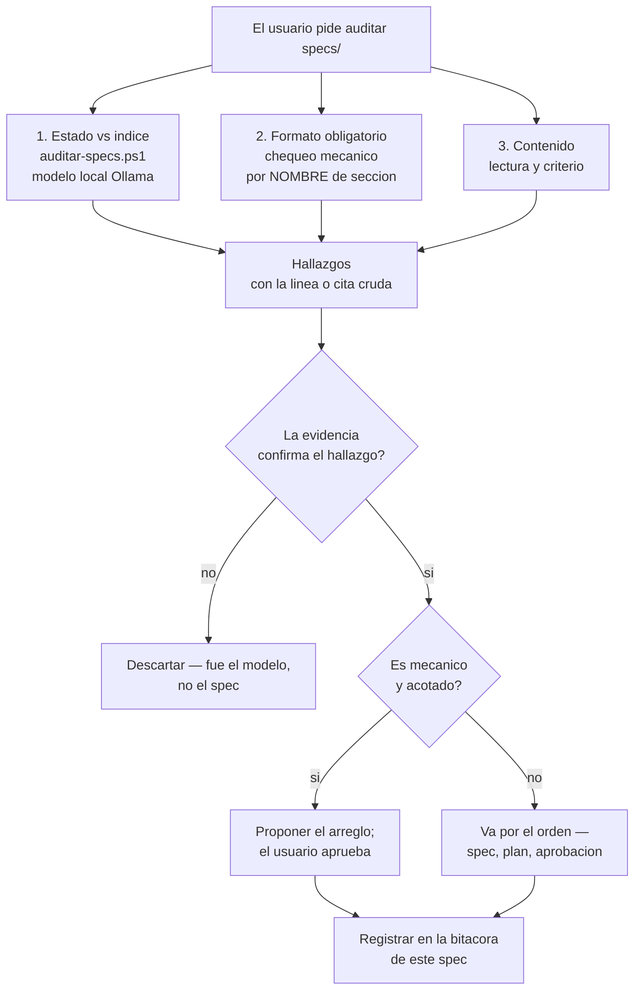

# Auditoría de los specs

**Hoy:** `specs/` tiene 26 documentos y un índice (`specs/README.md`) que declara el estado
de cada uno, y el formato obligatorio desde el 2026-09-09 (`formato-spec.md`) casi no está
adoptado: solo **4 de 26** specs declaran su estado en el frontmatter, 24 no tienen silogismo,
24 no tienen tabla de artefactos y 21 no tienen ningún diagrama. El estado de los specs
viejos es prosa en tres redacciones distintas, así que compararlo con el índice no se puede
grepear. Y cuando se comparó, aparecieron dos defectos reales: el propio `formato-spec.md`
contradecía su estado entre el frontmatter y el cuerpo, y `deploy-azure-aspire.md` declaraba
un estado fuera del vocabulario.

**Contenido:** §1–§4 el diseño · §5–§6 el plan · §7 las decisiones abiertas · §8 la bitácora

- **Estado:** **implementado.** La herramienta (`auditar-specs.ps1`) y el método ya existen y
  corrieron el 2026-09-14; la tercera dimensión (§3.3) está pendiente. **El trabajo precedió a
  este spec** — se dice explícito en §8.4, como manda `formato-spec.md` §4.1.
- **Alcance:** auditar `specs/` en tres dimensiones y reportar hallazgos con evidencia. No
  reescribe specs.
- **Fuera de alcance:** los specs en sí (qué dice cada uno y si está bien escrito); el código;
  el grafo de graphify, que tiene su propia memoria y su propia skill.

---

## 1. Problema

Tres cosas que se rompen sin que nadie mire, medidas el 2026-09-14:

1. **El índice puede divergir de los specs, y nada lo avisa.** El índice es lo que se lee para
   saber en qué estado está cada feature; el estado real vive en 26 archivos. Cuando se
   compararon, `formato-spec.md` tenía `estado: implementado` en el frontmatter y
   `**Estado:** **propuesto, pendiente de aprobación**` en el cuerpo — en el documento que
   define el formato. El índice estaba bien; el spec se contradecía solo.
2. **El formato obligatorio se adoptó poco, y eso no se puede confundir con un backlog.**
   `formato-spec.md` §10.1 decidió que la convención se propaga **por uso**: un spec viejo
   adopta el formato cuando se lo toca por otra razón. Sin una auditoría, la diferencia entre
   "todavía no se tocó" y "se tocó y quedó mal" es invisible, y las dos se ven igual: 24 specs
   sin silogismo.
3. **Un estado fuera del vocabulario rompe la lectura automática.** El vocabulario es cerrado
   (cinco palabras). `deploy-azure-aspire.md` declaraba `**funcionando y verificado**`: cierto
   como frase, inútil como dato — no hay nada que extraer ni con qué comparar.

## 2. Silogismo

La decisión discutible no es *si* auditar, sino **qué hace la auditoría con lo que encuentra**.

> **P1.** Reescribir los 22 specs que no siguen el formato es exactamente lo que
> `formato-spec.md` §10.1 descartó: re-extrae el grafo entero, produce un diff que nadie va a
> revisar línea por línea, y reescribe la bitácora de features ya cerradas —el único registro
> de por qué se decidieron así— sin agregar información.
>
> **P2.** Una auditoría que arreglara a medida que encuentra sería esa reescritura masiva,
> ejecutada sin revisión y disparada por un script. Es el modo de falla que la auditoría
> existe para prevenir, con el agravante de que borraría la evidencia que necesita para
> reportar.
>
> **∴** La auditoría **reporta con evidencia y no reescribe**. Cada hallazgo vuelve al usuario,
> que decide si se arregla, cuándo y en qué orden; los arreglos que toquen specs o código pasan
> por el orden de siempre (spec → plan → aprobación → código). Lo único que la auditoría
> escribe es su propio registro: este documento.
>
> *Si el índice empieza a divergir de forma sistemática, o si un hallazgo es puramente
> mecánico (una fila faltante, un estado fuera del vocabulario) y el usuario preaprueba esa
> clase de arreglo, esta decisión se reabre — acotada a esa clase.*

## 3. Decisión

Tres dimensiones con mecanismos distintos, porque no todas se pueden decidir igual. La salida
es **una tabla de hallazgos con la evidencia cruda**, no un veredicto.

**§3.1 Estado declarado vs índice.** `auditar-specs.ps1` (raíz del repo, versionado) extrae el
estado desde la prosa con un modelo local —`llama3.2:3b` por defecto, seed fija— y lo compara
con el índice. Es la única dimensión que necesita un modelo, porque la prosa vieja no se puede
parsear con una regex y una cuarta redacción rompería la tercera. **Es un filtro**: cada
veredicto viene con la línea cruda, y los modelos de 3-4B aciertan alrededor de la mitad de
los casos ambiguos (medido en la cabecera del script). Un `DISCREPA` se confirma leyendo la
línea **antes** de tocar nada — el 2026-09-14 los dos casos que reportó eran reales.

**§3.2 Formato obligatorio.** Chequeo mecánico contra la tabla de `formato-spec.md` §4.3:
frontmatter y vocabulario, `**Hoy:**`, `**Contenido:**` si pasa de 8 secciones, silogismo con
cláusula de reapertura, ≥1 diagrama Mermaid, tabla de artefactos con rutas reales, criterios
verificables, plan, bitácora, cierre. **Se busca por nombre de sección, no por número** (§8.3
explica el error que costó). Acá no hay modelo: es presencia y vocabulario. **El índice entra
en este chequeo** —para los enlaces y el vocabulario de estados—: es un archivo de `specs/` y
está sujeto a la misma regla de enlaces que los specs (§8.4, tercer hallazgo).

**§3.3 Contenido.** Afirmaciones vencidas, contradicciones entre specs sobre el mismo hecho,
superseded sin marcar, y estados que no reflejan la realidad. Una parte **sí** es mecánica y se
corrió el 2026-09-14: **las rutas que cada spec cita existen en el repo**, que es la forma
verificable de "el código que dice haber implementado está" (§8.4). El resto —afirmaciones
vencidas y contradicciones— se lee, se cita y se reporta.

**Cuidado con el vocabulario, porque acá es fácil inventar un defecto:** `implementado`
significa "código escrito y compilando; **puede faltar correr scripts o probar en pantalla**"
(`formato-spec.md` §4.1). Un spec que dice "faltan correr los scripts" **no** tiene el estado
mal: está exactamente donde le corresponde. El estado que miente es el otro, el que dice
`en-produccion` sin verificación, y eso el repo no lo puede saber.

## 4. Artefactos

| Acción | Ruta | Qué |
|---|---|---|
| existente | `auditar-specs.ps1` | la dimensión de estados, contra Ollama local (ya estaba en el repo) |
| nuevo | `specs/auditoria-specs.md` | este documento: método, hallazgos y bitácora de la auditoría |
| nuevo | `.agents/skills/auditar-specs/SKILL.md` | la skill que inicia la auditoría |
| modificado | `specs/README.md` | la fila de este spec |
| modificado | `specs/formato-spec.md` | primer hallazgo corregido: la prosa de estado contradecía el frontmatter (§8.4) |
| modificado | `specs/deploy-azure-aspire.md` | primer hallazgo corregido: estado fuera del vocabulario (§8.4) |

## 5. Criterios de aceptación

1. `auditar-specs.ps1` corre contra Ollama local, sin red externa, y **no modifica nada**:
   el hash de todos los `specs/*.md` es el mismo antes y después de correrlo.
2. Cada veredicto de la dimensión 1 trae su línea de evidencia cruda, y ninguno se toca sin
   confirmarla.
3. El chequeo de formato reporta **por nombre de sección**: un spec con `## Silogismo` sin
   número cuenta como que tiene silogismo. *(Criterio que falló en la primera corrida — §8.3.)*
4. La auditoría no edita ningún spec sin aprobación del usuario, y lo que se arregla queda
   registrado en la bitácora (§8).
5. La dimensión 1 distingue "el modelo no supo" (`?` / `REVISAR`) de "el spec y el índice no
   coinciden" (`DISCREPA`), y no reporta el primero como defecto del spec.
6. `specs/README.md` indexa este spec, con el estado que declara este archivo.
7. Los enlaces relativos entre specs siguen resolviendo, y no aparece ningún enlace de doble
   corchete. *(Verificado en la primera corrida: 0 rotos, 0 wikilinks.)*

## 6. Plan de implementación

1. **Fase 1 — estados vs índice.** El script ya existía; se corrió sobre los 26 specs.
2. **Fase 2 — formato obligatorio.** Chequeo mecánico por nombre de sección, con los números
   por spec.
3. **Fase 3 — contenido.** En curso: el tramo "el estado refleja la realidad" se corrió el
   2026-09-14 y dio **0 defectos reales** en 22 specs (§8.4). Quedan las afirmaciones vencidas y
   las contradicciones entre specs, cuyo método sigue abierto (§7.1).
4. **Fase 4 — los arreglos**, uno por uno, con aprobación; los dos primeros ya están (§8.4).
5. **Fase 5 (condicional).** Si el frontmatter se generaliza, la dimensión 1 se vuelve una
   comparación exacta y el modelo deja de ser necesario (§7.2).

## 7. Decisiones abiertas

### 7.1 La dimensión de contenido tiene método a medias

**Resuelto para un tramo (2026-09-14).** "El estado refleja la realidad" se verifica extrayendo
las rutas que el spec cita y comprobando que existan en el repo (§8.4). Es mecánico, acotado, y
dio **0 defectos reales** en los 22 specs con estado `implementado` o `en-produccion`.

**Abierto para el resto.** Afirmaciones vencidas y contradicciones entre specs siguen sin
método. Las opciones son hacerlas a mano una vez y ver qué aparece, o definirlas asistidas por
el grafo (los nodos y comunidades compartidas hacen visible qué specs hablan del mismo tema, que
es donde viven las contradicciones). Se decide con el resultado de este tramo a la vista.

### 7.2 `auditar-specs.ps1` y los dos lugares donde vive el estado

Desde 2026-09-14 hay specs con `estado:` en el frontmatter —el dato, según §4.1— y specs que
solo tienen la línea de prosa. El script va siempre al modelo. Dos mejoras posibles: que
**prefiera el frontmatter** cuando existe (comparación exacta, sin modelo), y que compare
**las dos copias** entre sí, porque la divergencia del 2026-09-14 fue exactamente eso. Sin
esto, una re-corrida puede marcar `REVISAR` a `formato-spec.md` por la línea de plantilla de
§4.2, que es un ejemplo y no una declaración.

### 7.3 Cuándo se corre

Por pedido del usuario, como todo lo demás que toca `specs/`: no hay hook ni chequeo
automático, y `formato-spec.md` §2 ya estableció que una regla que nadie puede hacer cumplir
es peor que ninguna.

## 8. Bitácora

### 8.1 Diseños descartados

- **Una regex sobre la prosa para extraer el estado.** Es lo primero que uno intenta y está
  argumentado en la cabecera del script: conviven `**Estado:** implementado`,
  `- **Estado:** **propuesto**` y `- **Estado:** implementado.`, y una regex sobre tres
  redacciones se rompe con la cuarta. La tarea —una de seis palabras, contexto chico, salida
  cerrada— es justamente lo que un modelo chico hace bien.
- **Creerle al veredicto del modelo.** Descartado: con 3-4B la mitad de los casos ambiguos
  salen mal. Por eso el script imprime la línea de evidencia y el veredicto `?` se reporta
  como "el modelo no supo", no como defecto.
- **Arreglar los 22 specs de una.** Descartado por §2: es la reescritura masiva que §10.1 ya
  había rechazado, y borraría la evidencia que la auditoría necesita.
- **Correr la auditoría como parte del commit o con un hook.** Descartado por §7.3.

### 8.2 Corregido al implementar

- **La dimensión de contenido se separó de las otras dos.** Estaba pensada como parte del
  mismo chequeo mecánico; al escribir el primer pase quedó claro que no lo es: las otras dos
  producen un dato, ésta produce un juicio, y mezclarlas habría hecho pasar por mecánico un
  hallazgo que no lo es.
- **El registro de la auditoría es un spec y no una memoria.** Las memorias del agente
  (`.claude/agent-memory/`) son para el cómo-trabajar; los hallazgos y los arreglos de los
  specs son historia del proyecto y van donde vive la historia: `specs/`.
- **El chequeo del formato lo levantó a este mismo documento.** La primera versión escribía el
  patrón de enlace prohibido como ejemplo **literal**, en dos lugares —el criterio de
  aceptación 7 y la tabla de §8.4—, y el chequeo mecánico lo contó como un wikilink real. Es el
  mismo error que `formato-spec.md` ya había registrado en la nota de su criterio 5: *los
  ejemplos de enlaces no se escriben con la sintaxis real*. Corregido a "enlace de doble
  corchete". Vale como recordatorio de por qué la auditoría reporta y no arregla: el error lo
  encontró el chequeo, no el que escribía.

### 8.3 El error que costó un chequeo entero

El primer pase mecánico buscaba las secciones **por número** (`## 2. Silogismo`). La mayoría de
los specs existentes no numera sus secciones, así que el pase reportó 24 specs sin silogismo y
24 sin artefactos — números inflados que habrían mandado a arreglar specs que no estaban mal.
Corregido a búsqueda **por nombre** (`## Silogismo` o `## 2. Silogismo`, lo que venga). Los
números que valen son los de §8.4. Queda como criterio de aceptación (§5.3): un chequeo que
reporta por número mide el formato de la numeración, no el contenido obligatorio.

### 8.4 Verificado empíricamente (2026-09-14)

Estado vs índice — `auditar-specs.ps1`, `llama3.2:3b`, seed 42, 26 specs: **24 OK · 1 DISCREPA
· 1 REVISAR**. Los dos casos eran reales, no ruido del modelo:

- `formato-spec.md` — **DISCREPA**: frontmatter `estado: implementado` contra
  `**Estado:** **propuesto, pendiente de aprobación**` en el cuerpo. Corregida la línea, y de
  paso la afirmación vencida de que este documento era el único. Registrado en la bitácora de
  ese spec (§11.5).
- `deploy-azure-aspire.md` — **REVISAR**: declaraba `**funcionando y verificado**`, fuera del
  vocabulario cerrado. Corregido a `**en producción**`; el índice ya decía `en-produccion`, o
  sea que el índice estaba bien y el spec no era legible como dato.

Formato obligatorio — 26 specs, sin README:

| Chequeo | Specs que no lo cumplen |
|---|---|
| `estado` en el frontmatter | 22 (solo 4 lo tienen) |
| `**Hoy:**` | 23 |
| `**Contenido:**` | — (solo obligatorio pasando de 8 secciones) |
| Sección Silogismo | 24 |
| Cláusula de reapertura | 23 |
| Sección Decisión | 7 |
| ≥1 diagrama Mermaid | 21 |
| Tabla de Artefactos | 24 |
| Criterios de aceptación | 17 |
| Plan de implementación | 9 |
| Bitácora | 10 |
| `**En pocas palabras:**` | 23 |
| Enlaces `.md` rotos | **0** |
| Enlaces de doble corchete | **0** |
| Specs sin fila en el índice | **0** |
| Frontmatter que discrepa del índice | **0** |

**Estado vs realidad — 22 specs con estado `implementado` o `en-produccion`.** Método: extraer
las rutas de archivo que cada spec cita en backticks y verificar que existan en el repo. Es la
forma mecánica de comprobar que el código que el spec dice haber implementado está.

- **19 de 22 resuelven todas sus rutas.** Sin ninguna rota: `rol-delivery` (27 citas),
  `numero-pedido` (21), `reparacion-ck-cuenta-metodo` (14), `comprobantes-qr` (20),
  `neon-branches-ambientes` (11, salvo el patrón de abajo), `numero-mesa-grilla-pedidos` (11),
  `tipo-pedido` (11), `agente-db` (10), `direccion-entrega`, `mesa-compartida-por-turno`,
  `postgres-local-dev`, `deploy-azure-aspire`, `enlace-corto-ubicacion`, `telemetria-postgres`,
  `orden-por-defecto-numero-pedido`, `mapa-entrega`, `dominio-personalizado-azure`,
  `pruebas-blazor-marca-login`, `barra-acciones-pedido`.
- **3 marcados, y los 3 son falsos positivos del chequeo** — valen como recordatorio de por qué
  un hallazgo se confirma antes de reportarse:
  `favicon-atipico.md` cita `Atipico.Web/wwwroot/favicon.png`, que **ese mismo spec borró** (su
  tabla de artefactos dice "Borrado: …" y el reemplazo, `favicon.svg`, está en el repo);
  `formato-spec.md` cita `sql/016_x.sql` y `Atipico.Api/Controllers/XController.cs`, que son los
  **ejemplos de su propia plantilla** de §6; y `neon-branches-ambientes.md` cita
  `sql/NNN_descripcion.sql`, que es un patrón, no una ruta.
- **Lo que este chequeo no puede ver:** si un `en-produccion` está verificado de verdad —eso lo
  sabe el usuario, no el repo— y si el código citado está commiteado o sólo en el árbol de
  trabajo.

**Un tercer hallazgo, sin arreglar a propósito.**

- `specs/README.md` escribe el patrón de enlace prohibido **literal** en la frase que documenta
  la regla. Va dentro de backticks, así que **no es un enlace roto**: en Obsidian y en GitHub se
  renderiza como texto. Lo que rompe es el chequeo, que lo cuenta como si fuera un enlace — y
  `formato-spec.md` ya arbitró esta clase exacta en la nota de su criterio 5: *los ejemplos de
  enlaces no se escriben con la sintaxis real*. **No se tocó**, porque §2 dice que la auditoría
  reporta y el usuario decide: los dos primeros arreglos se hicieron porque los pidió; éste
  espera la misma decisión.
- **La lección de alcance que lo dejó pasar:** el chequeo excluyó `README.md` por ser el índice
  y no un spec de feature, así que la primera corrida reportó **0** enlaces de doble corchete en
  todo `specs/`. Al incluirlo, aparece **1**. Un chequeo que excluye el archivo que documenta la
  regla no puede verificar la regla. Corregido el alcance en §3.2.

Lo último es lo que importa para §2: **el índice y los enlaces no están rotos**. El ejemplo
literal del README no rompe nada para un lector ni para Obsidian; es la clase de ejemplo que
`formato-spec.md` pide no escribir así, y lo que rompe es el chequeo automático. Lo que falta es
el formato nuevo en specs viejos, que se adopta por uso y no por decreto. La auditoría no lo
convierte en una lista de tareas.

---

**En pocas palabras:** la auditoría de specs tiene tres dimensiones —estado contra índice con
un modelo local, conformidad con el formato obligatorio de forma mecánica, y contenido a
juicio—, reporta cada hallazgo con su evidencia cruda y **no reescribe nada**: lo que encuentra
vuelve al usuario, que decide. Su registro es este spec, y en su primera corrida encontró y
corrigió dos defectos reales: un spec que se contradecía sobre su propio estado y otro que lo
declaraba fuera del vocabulario.
