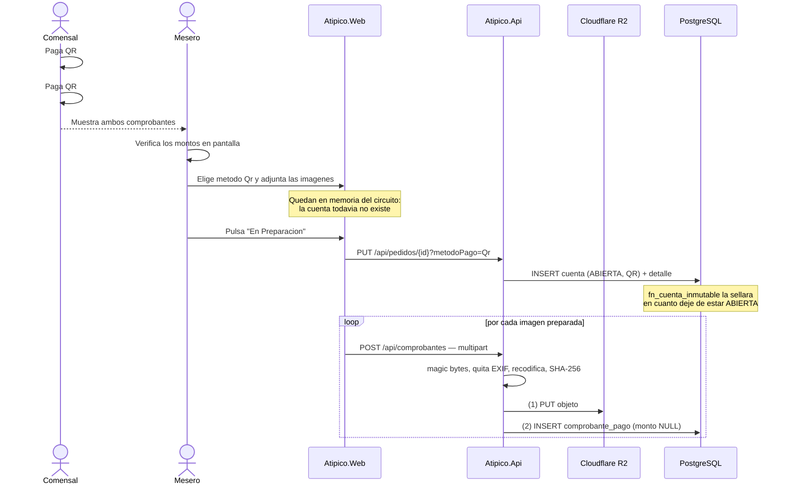
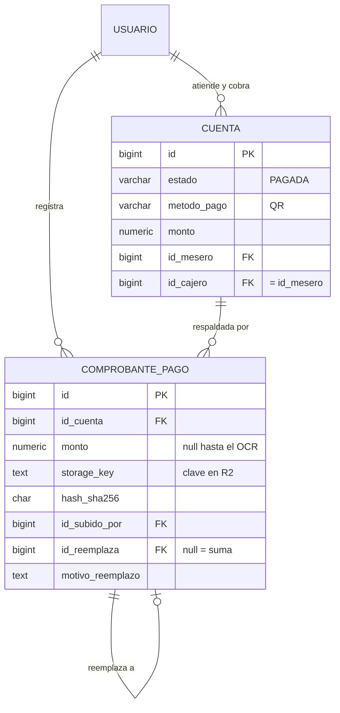

# Comprobantes de pago QR

Especificación funcional y técnica para adjuntar la evidencia de un pago por QR a una
`Cuenta`. Documento de referencia previo a la implementación: recoge las decisiones ya
tomadas y su porqué, para que no haya que volver a discutirlas al escribir el código.

- **Estado:** implementado y **verificado de punta a punta en desarrollo**: subida real a
  R2, migraciones `006` y `007` aplicadas. Pendiente la puesta en producción (§14).
- **Alcance:** cuentas con `MetodoPago.Qr`. El pago en efectivo queda fuera.
- **Almacenamiento:** Cloudflare R2 (compatible S3), bucket privado.

---

## 1. Contexto: el flujo es de pago adelantado

El comensal paga **antes** de ser atendido. El mesero verifica el comprobante en la pantalla
del teléfono del cliente y recién entonces levanta el pedido. El objetivo del flujo es
acelerar el movimiento de compra, así que nada debe frenar al mesero en el mostrador.

Consecuencias directas:

1. El dinero entra **antes** de que exista la cuenta.
2. Las imágenes de los comprobantes **se adjuntan después**, para no bloquear la fila.
3. Un mismo comensal puede pagar con **varios QR**: el primero no cubre el total por saldo
   insuficiente, o el monto se digita mal y hay que completar con un segundo pago.

**Cómo nace la cuenta, en la práctica.** Hay dos caminos, y no coinciden:

| Camino | Estado inicial | Cajero |
|---|---|---|
| `Pedidos/Edit` → "En Preparación" (el habitual) | `ABIERTA` — `CrearCuentaAutomaticaAsync` no fija estado | Sin asignar |
| `Cuentas/Edit` → alta manual como Pagada | `PAGADA` | `id_cajero = id_mesero`, sellado por `CuentasController.Create` |

Esto importa para la conciliación: una cuenta puede estar **cobrada de verdad y seguir
marcada `ABIERTA`**, así que los reportes no pueden filtrar por `PAGADA` (ver §4).



---

## 2. Decisión de fondo: tabla aparte, no columna

La evidencia **no** vive en una columna de `cuenta`. Dos restricciones independientes lo
impiden, y basta con cualquiera de las dos.

### 2.1 El trigger de inmutabilidad

`fn_cuenta_inmutable` (en `sql/script_inicial.sql`) rechaza cualquier `UPDATE` sobre una
cuenta que ya no esté `ABIERTA`. La única excepción es la transición documentada de
`PAGADA` a `ANULADA`, y está escrita de forma que exige que ningún otro campo cambie:
compara `to_jsonb(NEW)` contra `to_jsonb(OLD)` descontando solo las cuatro columnas de
anulación.

Como en este flujo la cuenta nace `PAGADA` y el comprobante llega después, llenar una
columna `comprobante_key` sería rechazado. El fallo no aparece en las pruebas de la capa de
aplicación: aparece en producción.

Además, esa comparación con `to_jsonb` incluye automáticamente cualquier columna nueva de la
tabla, así que agregar el campo lo engancharía a la lógica de anulación sin decidirlo.

### 2.2 La cardinalidad

Una columna sostiene un valor. Una cuenta admite varios comprobantes, así que la columna no
alcanza aunque el trigger no existiera.

> Las dos restricciones son independientes. Relajar el trigger no resolvería la
> cardinalidad, y un flujo de un solo comprobante seguiría chocando con el trigger.

---

## 3. Modelo de datos



### 3.1 Semántica de «varios comprobantes»

Hay dos comportamientos distintos que no deben confundirse:

| Caso | Qué significa | Cómo se representa |
|---|---|---|
| Pago partido (saldo insuficiente, monto mal digitado) | Cada comprobante respalda **una parte** del total | Filas con `id_reemplaza IS NULL`; sus montos **suman** |
| Corrección (foto borrosa, imagen equivocada) | El nuevo **sustituye** al anterior | Fila con `id_reemplaza` apuntando a la anterior; la anterior deja de sumar |

**Vigente** es todo comprobante al que nadie reemplazó. La conciliación compara la suma de
los vigentes contra `cuenta.monto`.

### 3.1.1 El monto se extraerá del comprobante, no se teclea

`monto` es **nullable**, y `NULL` significa *«todavía no se determinó cuánto respalda»*.

Nadie teclea ese importe. Está previsto extraerlo de la propia imagen por OCR, que es donde
la cifra ya está escrita: pedírsela al mesero sería transcribir a mano un dato que el
comprobante trae impreso, y en el mostrador es justo el tipo de fricción que este flujo
evita. Hasta que el OCR exista, todos los comprobantes se registran con `monto` en `NULL`.

Esto no debilita el control, lo escalona:

| Hoy | Con OCR |
|---|---|
| Se detecta la cuenta QR **sin ninguna evidencia** | Además, se detecta la evidencia que **no cubre** el cobro |
| El hash sigue cazando el archivo reutilizado | Igual |

La vista de conciliación (§4) ya contempla los dos casos, así que cuando el OCR empiece a
llenar montos el reporte se vuelve más estricto solo. No hace falta tocarla.

### 3.2 Por qué el reemplazo es obligatorio en el modelo

La tabla es solo-inserción y el rol `app_restaurante` no tiene `DELETE`. Sin una forma de
sustituir una fila, un monto mal tecleado quedaría mal para siempre y esa cuenta aparecería
en el reporte de conciliación indefinidamente, sin manera de corregirla. `id_reemplaza` es
la única salida compatible con el modelo de inmutabilidad ya vigente en el esquema.

### 3.3 DDL

Va en `sql/006_comprobante_pago.sql`, siguiendo la convención de scripts numerados.
`script_inicial.sql` no se edita una vez aplicado.

> El DDL de abajo ya refleja `monto` nullable. La `006` se aplicó con `monto NOT NULL`, así
> que el cambio viaja en **`sql/007_comprobante_monto_opcional.sql`**: suelta el `NOT NULL`,
> reemplaza `ck_comprobante_monto` y recrea la vista de conciliación. Se recrea y no se
> reemplaza porque cambia su lista de columnas, y `CREATE OR REPLACE VIEW` solo admite
> agregar al final — por eso el script repone también su `GRANT`.

```sql
CREATE TABLE comprobante_pago (
    id                bigint GENERATED ALWAYS AS IDENTITY PRIMARY KEY,
    id_cuenta         bigint        NOT NULL,
    monto             numeric(12,2),          -- null = pendiente de extraer por OCR
    storage_key       text          NOT NULL,
    hash_sha256       char(64)      NOT NULL,
    tipo_contenido    varchar(30)   NOT NULL,
    bytes             integer       NOT NULL,
    id_subido_por     bigint        NOT NULL,
    creado_en         timestamptz   NOT NULL DEFAULT now(),
    id_reemplaza      bigint,
    motivo_reemplazo  text,
    CONSTRAINT fk_comprobante_cuenta    FOREIGN KEY (id_cuenta)
        REFERENCES cuenta (id) ON DELETE RESTRICT,
    CONSTRAINT fk_comprobante_usuario   FOREIGN KEY (id_subido_por)
        REFERENCES usuario (id) ON DELETE RESTRICT,
    CONSTRAINT fk_comprobante_reemplaza FOREIGN KEY (id_reemplaza)
        REFERENCES comprobante_pago (id) ON DELETE RESTRICT,
    CONSTRAINT uk_comprobante_key UNIQUE (storage_key),
    -- el mismo archivo no se registra dos veces en la misma cuenta
    CONSTRAINT uk_comprobante_cuenta_hash UNIQUE (id_cuenta, hash_sha256),
    -- la cadena de reemplazos no se bifurca; varios NULL siguen permitidos
    CONSTRAINT uk_comprobante_reemplaza UNIQUE (id_reemplaza),
    CONSTRAINT ck_comprobante_monto CHECK (monto IS NULL OR monto > 0),
    CONSTRAINT ck_comprobante_bytes CHECK (bytes > 0),
    CONSTRAINT ck_comprobante_tipo  CHECK (
        tipo_contenido IN ('image/webp','image/jpeg','image/png')),
    -- reemplazar exige motivo, igual que anular una cuenta
    CONSTRAINT ck_comprobante_reemplazo CHECK (
        id_reemplaza IS NULL
        OR (motivo_reemplazo IS NOT NULL AND btrim(motivo_reemplazo) <> ''))
);

CREATE INDEX ix_comprobante_cuenta ON comprobante_pago (id_cuenta, creado_en DESC);
CREATE INDEX ix_comprobante_hash   ON comprobante_pago (hash_sha256);

-- Mismo criterio que fn_detalle_inmutable: se reemplaza, no se edita.
CREATE OR REPLACE FUNCTION fn_comprobante_inmutable() RETURNS trigger AS $$
DECLARE v_metodo varchar(20); v_cuenta_previa bigint;
BEGIN
    IF TG_OP <> 'INSERT' THEN
        RAISE EXCEPTION 'Un comprobante no se edita ni se borra: registre uno nuevo';
    END IF;

    SELECT metodo_pago INTO v_metodo FROM cuenta WHERE id = NEW.id_cuenta;
    IF v_metodo IS DISTINCT FROM 'QR' THEN
        RAISE EXCEPTION 'La cuenta % no se pago por QR', NEW.id_cuenta;
    END IF;

    IF NEW.id_reemplaza IS NOT NULL THEN
        SELECT id_cuenta INTO v_cuenta_previa
          FROM comprobante_pago WHERE id = NEW.id_reemplaza;
        IF v_cuenta_previa IS DISTINCT FROM NEW.id_cuenta THEN
            RAISE EXCEPTION 'Un comprobante solo reemplaza a otro de la misma cuenta';
        END IF;
    END IF;

    RETURN NEW;
END;
$$ LANGUAGE plpgsql;

-- Prefijo tg_, como el resto de triggers del esquema.
CREATE TRIGGER tg_comprobante_inmutable
    BEFORE INSERT OR UPDATE OR DELETE ON comprobante_pago
    FOR EACH ROW EXECUTE FUNCTION fn_comprobante_inmutable();

-- El ALTER DEFAULT PRIVILEGES del BLOQUE 2 solo alcanza a los objetos creados por el
-- mismo rol que lo ejecuto. Explicito para no depender de con que usuario corra esto.
GRANT SELECT, INSERT ON comprobante_pago TO app_restaurante;
GRANT SELECT ON v_comprobante_vigente             TO app_restaurante;
GRANT SELECT ON v_cuenta_qr_evidencia_incompleta  TO app_restaurante;
GRANT SELECT ON v_comprobante_duplicado           TO app_restaurante;
```

### 3.4 Sobre `hash_sha256`

Con el mesero actuando también como cajero, el fraude más simple es cobrar en efectivo y
adjuntar el screenshot de un pago QR anterior. El hash lo detecta:

- `uk_comprobante_cuenta_hash` impide reutilizar el mismo archivo dentro de una cuenta.
- `v_comprobante_duplicado` detecta el reuso entre cuentas distintas.

Es además el único campo caro de agregar después: rellenarlo obligaría a descargar y releer
cada objeto ya guardado en R2.

---

## 4. Conciliación y reportes

**Principio.** Ninguna restricción obliga a que la suma de los comprobantes coincida con
`cuenta.monto`, y es deliberado: el error de digitación puede dejar la suma por encima del
total —el comensal transfirió de más y se le devuelve la diferencia en efectivo— y la base
tiene que poder registrar eso. La tabla guarda lo que pasó; la vista señala lo que no cuadra.
Es el mismo reparto de responsabilidades de `v_cuenta_descuadrada`.

```sql
-- Evidencia vigente: la que nadie reemplazo.
CREATE OR REPLACE VIEW v_comprobante_vigente AS
SELECT cp.id, cp.id_cuenta, cp.monto, cp.storage_key, cp.hash_sha256,
       cp.id_subido_por, cp.creado_en
  FROM comprobante_pago cp
 WHERE NOT EXISTS (SELECT 1 FROM comprobante_pago r WHERE r.id_reemplaza = cp.id);

-- Cuentas QR cobradas cuya evidencia vigente no cubre exactamente el monto.
CREATE OR REPLACE VIEW v_cuenta_qr_evidencia_incompleta AS
SELECT c.id, c.comensal, c.estado, c.monto, c.pagado_en, c.id_mesero,
       count(v.id)                                AS comprobantes,
       count(v.id) FILTER (WHERE v.monto IS NULL) AS sin_monto,
       COALESCE(SUM(v.monto), 0)                  AS monto_respaldado
  FROM cuenta c
  LEFT JOIN v_comprobante_vigente v ON v.id_cuenta = c.id
 WHERE c.estado <> 'ANULADA' AND c.metodo_pago = 'QR'
 GROUP BY c.id
HAVING count(v.id) = 0
    OR (count(v.id) FILTER (WHERE v.monto IS NULL) = 0
        AND c.monto IS DISTINCT FROM COALESCE(SUM(v.monto), 0));

-- Un mismo archivo reutilizado en cuentas distintas.
-- Dentro de una misma cuenta ya lo impide uk_comprobante_cuenta_hash.
CREATE OR REPLACE VIEW v_comprobante_duplicado AS
SELECT cp.id, cp.id_cuenta, cp.hash_sha256, cp.monto, cp.creado_en, cp.id_subido_por
  FROM comprobante_pago cp
 WHERE cp.hash_sha256 IN (
       SELECT hash_sha256 FROM comprobante_pago
        GROUP BY hash_sha256 HAVING count(DISTINCT id_cuenta) > 1);
```

**El filtro de estado es `<> 'ANULADA'`, no `= 'PAGADA'`.** Se corrigió al implementar la
interfaz, y el motivo importa: `PedidosController.CrearCuentaAutomaticaAsync` crea la cuenta
**sin fijar estado**, o sea `ABIERTA`, aunque el dinero ya haya entrado. Filtrar por
`PAGADA` habría dejado fuera justo las cuentas del flujo que este reporte vigila, y el
reporte habría salido siempre vacío. Mismo criterio que `v_cuenta_descuadrada`.

Consecuencia a registrar: en este flujo una cuenta puede estar cobrada de verdad y seguir
marcada `ABIERTA` hasta que alguien la pase a `PAGADA` desde caja. La conciliación no depende
de esa marca sino del dinero y su evidencia.

El `HAVING` tiene dos ramas, y hoy solo la primera hace trabajo:

| Rama | Qué detecta | Activa |
|---|---|---|
| `count(v.id) = 0` | Cuenta QR **sin ninguna evidencia** | Desde ya |
| `sin_monto = 0 AND monto <> suma` | Evidencia que **no cubre** el cobro | Cuando el OCR llene montos |

Mientras los montos sean `NULL`, la segunda rama nunca se cumple y el reporte es una lista
de cuentas sin comprobante. Cuando el OCR empiece a llenarlos, la misma vista pasa a exigir
que la evidencia cuadre, sin tocar una línea. Por eso se escribió así desde el principio.

Con montos disponibles, el signo de `monto - monto_respaldado` distingue los dos casos:

| Signo | Significado | Acción |
|---|---|---|
| `> 0` | Falta evidencia por ese importe | Adjuntar el comprobante que falta |
| `< 0` | El comensal transfirió de más | Devolver la diferencia en efectivo |

La condición `sin_monto = 0` es la que evita el falso positivo obvio: una cuenta con dos
comprobantes de los que solo uno tiene monto extraído no está descuadrada, está a medio
procesar.

Las tres vistas se mapean como entidades sin clave (`.HasNoKey().ToView(...)`) y se exponen
de solo lectura por `ReportesController`, **no** por `EntityControllerBase<T>`, igual que
`CuentaDescuadrada` y `PedidoPlatoSinCobrar`.

---

## 5. Almacenamiento

| Aspecto | Decisión |
|---|---|
| Bucket | **Privado.** Sin dominio público ni `r2.dev`. Es un dato financiero de un tercero. |
| Clave | `comprobantes/{idCuenta}/{uuidv7}.webp` — no adivinable, ordena por tiempo, no colisiona entre los varios comprobantes de una cuenta. Se usa `Guid.CreateVersion7()` en vez de un ULID: mismas propiedades, sin sumar un paquete. |
| En la base | Solo la clave, nunca una URL completa. Cambiar de proveedor queda como reconfiguración, no como migración de datos. |
| Subida | **A través de la API**, no directa desde el navegador. |
| Lectura | URL firmada de 5 minutos, emitida por la API tras validar el rol. El navegador descarga directo de R2. |

**Por qué la subida pasa por la API.** Para fotos de producto convendría la subida directa
prefirmada, porque el binario no toca el servidor. Para evidencia se necesita lo contrario:
validar los *magic bytes*, quitar el EXIF —que en fotos de teléfono lleva coordenadas GPS—,
recodificar y calcular el hash **antes** de que el objeto exista. Con subida directa esas
garantías se vuelven una verificación posterior, y una verificación posterior que falla deja
un objeto ya guardado.

**Orden de escritura.** Primero el objeto en R2, después la fila en PostgreSQL. Si falla el
segundo paso queda un objeto huérfano, que es inofensivo y lo barre una regla de ciclo de
vida. El orden inverso deja un registro que promete una evidencia inexistente.

**Procesamiento de imagen.** Recodificar a WebP con calidad alta y lado largo topado en
2000 px. Lo que importa es que se lean el monto y el número de operación, no que el archivo
sea pequeño. No aplicar la compresión agresiva que se usaría en una miniatura.

**Orientación antes que limpieza.** Un teléfono guarda la foto vertical como apaisada más
una marca de rotación en el EXIF. Si se borra el EXIF sin aplicar esa marca primero, el
comprobante queda de lado e ilegible. El orden es: `AutoOrient()`, luego redimensionar,
luego borrar los perfiles EXIF/XMP/IPTC.

**Qué se hashea.** El SHA-256 se calcula sobre el contenido **ya procesado**, no sobre el
original, para que el hash describa exactamente el objeto guardado y sirva también para
verificar su integridad. La recodificación es determinista, así que el mismo archivo subido
dos veces produce el mismo hash.

---

## 6. API

Endpoints nuevos en `ComprobantesController`. **No** extiende `EntityControllerBase<T>`:
recibe `multipart/form-data` y habla con el almacenamiento.

| Método | Ruta | Descripción |
|---|---|---|
| `POST` | `/api/comprobantes` | Registra uno. Campos: `idCuenta`, `archivo`, y opcionalmente `idReemplaza` + `motivoReemplazo`. El monto no se envía: lo llenará el OCR. |
| `GET` | `/api/comprobantes/cuenta/{idCuenta}` | Metadatos de los comprobantes de una cuenta, vigentes e historial. |
| `GET` | `/api/comprobantes/{id}/url` | Devuelve una URL firmada de 5 minutos. |

En `ReportesController`:

| Método | Ruta | Roles |
|---|---|---|
| `GET` | `/api/reportes/cuentas-qr-evidencia-incompleta` | Mesero, Cajero, Admin |
| `GET` | `/api/reportes/comprobantes-duplicados` | Cajero, Admin |

**Base común.** `ComprobantesController` no es CRUD sobre una entidad, así que no hereda de
`EntityControllerBase<T>` — pero sí necesita traducir errores de la base. La traducción y el
chequeo de roles se extrajeron a `ApiControllerBase`, del que ahora heredan ambos; duplicar
el mapeo de restricciones habría garantizado que las dos copias se separaran con el tiempo.
Ahí también vive `UsuarioActualId`, que lee el id del token: quién registra un comprobante
nunca se toma del cuerpo de la petición.

**Traducción de errores.** El patrón a envolver en cada escritura:

```csharp
try { /* AddAsync */ }
catch (DbUpdateException ex)
{
    var r = TryTranslateDbError(ex);
    if (r is not null) return r;
    throw;
}
```

Sin eso, los mensajes de `fn_comprobante_inmutable` y de `uk_comprobante_cuenta_hash` llegan
como un 500 con stack trace en vez de un 409 en español.

### 6.1 Cambio obligatorio en `CuentasController`

`ck_cuenta_pago` exige `metodo_pago`, `pagado_en` e `id_cajero` cuando el estado es `PAGADA`.
`CuentasController` solo sobrescribe `Update` para sellar `PagadoEn`; `Create` usa la
implementación base, que no sella nada.

Crear una cuenta ya pagada —que es exactamente lo que pide este flujo— viola el CHECK y
devuelve 400. Hay que sobrescribir `Create` para:

1. Sellar `PagadoEn = DateTimeOffset.UtcNow` cuando el estado entrante sea `Pagada`.
   Nunca tomarlo del cliente: Npgsql rechaza `DateTimeOffset` con offset distinto de cero
   sobre `timestamptz`.
2. Copiar `IdMesero` en `IdCajero` cuando este último llegue vacío.

**Nota favorable.** `CuentasController.UpdateRoles` excluye al mesero, pero en este flujo
nunca necesita actualizar nada: crea la cuenta en su estado final y no la vuelve a tocar. El
permiso actual y el modelo de inmutabilidad quedan alineados sin cambiar ninguno.

---

## 7. Roles

| Acción | Mesero | Cajero | Admin | Cocinero |
|---|:---:|:---:|:---:|:---:|
| Ver los comprobantes | Sí | Sí | Sí | No |
| Registrar uno nuevo | Sí | Sí | Sí | No |
| Reemplazar con motivo | Sí | Sí | Sí | No |
| Reporte de evidencia incompleta | Sí | Sí | Sí | No |
| Reporte de duplicados | No | Sí | Sí | No |

El mesero ve los comprobantes porque es quien los verifica en el mostrador. Queda fuera del
reporte de duplicados por la misma razón por la que ese reporte existe: es el control sobre
quien registra el cobro.

**Consecuencia de `id_cajero = id_mesero`.** Quien cobra y quien atiende pasan a ser la misma
persona en el registro, así que la separación de responsabilidades que permite la tabla deja
de existir en la práctica. Es una decisión consciente para acelerar la fila. A partir de
aquí, el control sobre el cobro no lo da la estructura de roles sino los comprobantes, el
hash y las dos vistas de conciliación.

---

## 8. Interfaz

El panel vive en `Components/Shared/ComprobantesPanel.razor` y lo usan **dos** páginas,
porque el momento de verificar el comprobante no es el mismo que el de revisarlo:

| Página | Por qué |
|---|---|
| `Pedidos/Edit.razor` | En el pago adelantado el mesero verifica el comprobante en el mostrador, con el pedido delante. Es ahí donde lo adjunta. |
| `Cuentas/Edit.razor` | Para revisar o corregir después, desde caja. |

El panel muestra la lista de vigentes —con su monto cuando ya se extrajo, o
«pendiente» mientras no—, el historial de reemplazos con `ToBoliviaTime()`, y el formulario
de carga, que es solo el selector de archivo.

**Cómo llega el pedido a su cuenta.** No hay FK directa: el vínculo es
`Pedido → PedidoPlato → DetalleCuenta → Cuenta`. `Pedidos/Edit.razor` recorre esa cadena y
se queda con las cuentas de método QR. Un pedido puede haber generado más de una cuenta, así
que se renderiza un panel por cada una.

### 8.1 Adjuntar antes de que exista la cuenta

En la pantalla de pedido el mesero elige **Qr** como método de pago mientras el comensal
tiene el comprobante en la mano. En ese momento la cuenta **todavía no existe**: la crea
`PedidosController` al pasar el pedido a `EnPreparacion`. El comprobante no tiene a qué
colgarse.

La salida es una **zona de preparación** en `Pedidos/Edit.razor`, debajo de la lista de
platos del pedido, que aparece en cuanto se selecciona Qr:

1. El mesero adjunta una o varias imágenes. Sin teclear nada.
2. Al pulsar **En Preparación** se factura y nace la cuenta, como siempre.
3. Recién ahí se suben los archivos preparados, ya con el `IdCuenta` real.

**No se pide monto en ninguna de las dos pantallas.** Ni aquí ni en `Cuentas/Edit.razor`:
el importe lo llenará el OCR leyéndolo de la imagen (§3.1.1), así que pedirlo sería hacer
transcribir a mano un dato que el comprobante ya trae impreso. Los comprobantes se registran
con `monto` en `NULL` y la conciliación, mientras tanto, vigila lo que sí puede: que ninguna
cuenta QR se quede sin evidencia.

Va **debajo de la lista de platos** a propósito: el mesero primero ve qué está cobrando y
recién después adjunta el comprobante que lo respalda. Queda dentro de la columna de platos,
no al final de la pantalla, para que siga a la vista sin tener que bajar.

### 8.1.1 Elegir Qr lleva el foco al adjunto

> Agregado después de mover las acciones a una barra fija al pie
> ([`barra-acciones-pedido.md`](barra-acciones-pedido.md)).

Arriba se dice que la zona queda dentro de la columna de platos «para que siga a la vista
sin tener que bajar». **Esa premisa se rompió**, y no por esta pantalla: el select de método
de pago se mudó a la barra de acciones, que está fija **al pie**. Antes estaba justo encima
de la zona de comprobantes, así que elegir Qr la hacía aparecer debajo del cursor. Ahora se
elige abajo y la zona aparece arriba, fuera de pantalla.

Al elegir **Qr**, entonces, la pantalla salta al campo de archivo.

**Salta y además lo enfoca**, con `ElementReference.FocusAsync()`. No es un `scrollIntoView`
por interop: enfocar ya desplaza, y el campo de archivo es exactamente lo siguiente que el
mesero toca, así que dejar el foco ahí es correcto y no un efecto colateral. Importa además
que este proyecto **no tiene ningún archivo JavaScript propio** —solo `blazor.web.js`, y toda
la interop usa builtins del navegador (`confirm`, `prompt`)—: un scroll no justifica ser la
primera pieza de JS del repo.

**El salto necesita `scroll-margin-bottom`.** `focus()` desplaza lo mínimo para que el
elemento entre en pantalla, y el navegador no sabe que hay una barra fija tapando el pie:
sin margen, dejaría el campo justo debajo de ella. `scroll-margin-bottom` es la forma
declarativa de reservar ese despeje, y lleva los mismos valores que el espaciador de la
barra.

**Solo en la transición a Qr**, y **después del re-render**: la zona no existe hasta que
Blazor vuelve a dibujar con el método ya elegido, así que el salto se pide en el `@bind:after`
del select y se ejecuta en `OnAfterRenderAsync`. Pedirlo en el mismo instante del cambio
apuntaría a un elemento que todavía no está en el DOM.

No salta al abrir un pedido que ya tenía Qr elegido: eso no es una elección del usuario y
moverle la pantalla sin que haya tocado nada es peor que no hacer nada.

**Verificado** con el `app.css` real, replicando el recorrido de verdad —partir del pie,
donde está el select, y saltar hacia arriba—:

| | 375×812 | 1200×800 |
|---|---|---|
| Scroll | 1657 → 840 | 1521 → 797 |
| Campo tapado por la barra | no | no |
| Campo tapado por la franja superior | no | — |
| Tarjeta QR entera visible | sí | sí |
| Foco | en el campo de archivo | en el campo de archivo |

Lo que queda sin ejercitar es el disparo desde Blazor: que `@bind:after` marque la bandera
y que `OnAfterRenderAsync` encuentre el `ElementReference` ya montado. Eso necesita la
aplicación corriendo.

**Adjuntar es opcional y nunca bloquea.** Si no se preparó ningún archivo, el pedido se
factura igual y la cuenta se crea igual. Si la subida falla después de creada la cuenta, la
cuenta **no se revierte**: el dinero entró y el registro debe reflejarlo. Se avisa del fallo
y la cuenta queda listada en el reporte de evidencia incompleta, que existe justamente para
eso. Es la misma decisión de §12: se reporta, no se bloquea.

**Los bytes se leen al seleccionar, no al enviar.** Un `IBrowserFile` es una referencia al
archivo del navegador que se lee por el circuito SignalR; conservarla entre interacciones es
frágil, porque cualquier recomposición del `InputFile` la invalida. Como entre la selección y
la subida media un viaje al servidor para facturar, el contenido se copia a memoria en el
momento de elegirlo. El costo es memoria del servidor por circuito mientras dura la pantalla,
acotado por el tope de tamaño y por la cantidad de archivos preparados.

Una vez facturado el pedido, la zona de preparación desaparece y el `ComprobantesPanel`
normal toma su lugar: ya hay cuenta, y las altas van directo.

**Contra la fricción.** Ninguna de las dos pantallas pide importes: adjuntar un comprobante
es elegir el archivo y nada más. El monto queda pendiente hasta que el OCR lo extraiga.

Páginas nuevas de reporte en `Reportes/`, siguiendo a `CuentasDescuadradas.razor`.

**Límite de Blazor Server.** `IBrowserFile.OpenReadStream()` corta en ~500 KB y lanza
excepción. Con el mesero fotografiando desde el teléfono, esto salta en la primera prueba
real: hay que pasar el máximo explícitamente.

---

## 9. Configuración

Cuatro variables nuevas, con `sync: false` en `render.yaml` igual que las de JWT, y
replicadas en `docker-compose.yml` y `.env.example`:

| Variable | Uso |
|---|---|
| `R2__AccountId` | Compone el `ServiceURL` del cliente S3 |
| `R2__AccessKeyId` | Credencial |
| `R2__SecretAccessKey` | Credencial |
| `R2__Bucket` | Bucket de comprobantes |

El adaptador usa `AWSSDK.S3` con `ForcePathStyle = true`.

---

## 10. Verificaciones — resueltas en desarrollo

- [x] **La base acepta `QR`.** Era el riesgo de fondo: `sql/script_inicial.sql` define
      `ck_cuenta_metodo` con `EFECTIVO, TARJETA, TRANSFERENCIA, YAPE, PLIN` y sin `QR`, y
      `schema_completo.sql` documenta el desvío. La prueba confirma que la base desplegada
      sí lo acepta, como afirmaba el comentario de `MetodoPago.cs`. **Vale volver a
      confirmarlo en producción**: el desvío es por base, no por código.
- [x] **Librería de imagen: SixLabors.ImageSharp 3.1.12.** La 4.x emite un aviso en cada
      compilación exigiendo licencia; la 3.1 se rige por la Six Labors Split License, libre
      para esta escala. Se prefirió sobre SkiaSharp porque es manejada pura y no obliga a
      instalar librerías nativas en el contenedor. Si la facturación crece, revisar la
      licencia o migrar a SkiaSharp.
- [x] **GRANT sobre los objetos nuevos.** Los scripts los reponen explícitamente, incluido
      el de la vista recreada en la `007`.
- [x] **Subida real contra R2.** Verificada de punta a punta: la firma con
      `DisablePayloadSigning` y `AuthenticationRegion = "auto"` funciona contra R2, que era
      lo único que las pruebas con dobles no podían cubrir.

---

## 11. Plan de implementación

### Fase 1 — registrar y ver

| # | Archivo | Qué hace | Estado |
|---|---|---|:---:|
| 1 | `sql/006_comprobante_pago.sql` | Tabla, trigger, tres vistas, GRANT | Hecho |
| 1b | `sql/007_comprobante_monto_opcional.sql` | `monto` nullable + vista de conciliación con las dos ramas | Hecho |
| 2 | `Atipico.Domain/Entities/ComprobantePago.cs` | Entidad + tres entidades de vista | Hecho |
| 3 | `Atipico.Infraestructure/Persistence/Configurations/` | Cuatro configuraciones EF | Hecho |
| 4 | `Atipico.Infraestructure/Persistence/AppDbContext.cs` | Cuatro `DbSet` | Hecho |
| 4b | `Atipico.Infraestructure.Tests/ModeloComprobantePagoTest.cs` | Valida que el modelo EF se construya: los errores de mapeo no salen al compilar | Hecho |
| 5 | `Atipico.Application/Common/Interfaces/` | Puertos `IAlmacenComprobantes` e `IProcesadorImagenComprobante`, más `ComprobanteService` | Hecho |
| 6 | `Atipico.Infraestructure/Storage/`, `Imaging/` | Adaptadores R2 (`AWSSDK.S3`) e ImageSharp | Hecho |
| 6b | `Atipico.Application.Tests/ComprobanteServiceTests.cs` | Cubre el orden objeto→fila y que no se escriba la fila si falla el bucket | Hecho |
| 7 | `Atipico.Api/Controllers/ComprobantesController.cs` | Los tres endpoints, sobre `ApiControllerBase` | Hecho |
| 8 | `Atipico.Api/Controllers/CuentasController.cs` | Sobrescribir `Create` (ver §6.1) | Hecho |
| 9 | `Atipico.Web/Components/Shared/ComprobantesPanel.razor` | Panel reutilizable + `ComprobanteApiClient` (multipart) | Hecho |
| 9b | `Cuentas/Edit.razor` y `Pedidos/Edit.razor` | Integran el panel; el de pedidos resuelve sus cuentas por la cadena de detalle | Hecho |
| 10 | `render.yaml`, `docker-compose.yml`, `.env.example` | Variables de R2 | Hecho |

Todo compila y las pruebas pasan, pero **nada se ha ejercitado contra R2 real ni contra la
base con la migración aplicada**: las pruebas usan dobles del almacenamiento.

### Fase 2 — control

| # | Archivo | Qué hace | Estado |
|---|---|---|:---:|
| 11 | `Atipico.Api/Controllers/ReportesController.cs` | Dos endpoints de reporte | Hecho |
| 12 | `Atipico.Web/Services/ApiRoutes.cs` | Registrar las rutas nuevas | Hecho |
| 13 | `Reportes/EvidenciaIncompleta.razor` | Lista de cierre de turno | Hecho |
| 14 | `Reportes/ComprobantesDuplicados.razor` | Solo Cajero y Admin, agrupado por hash | Hecho |
| 15 | `Components/Layout/NavMenu.razor` | Enlaces a ambos reportes | Hecho |

---

## 12. Fuera de alcance

- **Cierre del sobrepago.** Cuando el comensal transfiere de más y se le devuelve la
  diferencia en efectivo, la cuenta queda visible en el reporte de conciliación de forma
  permanente. No se construye ninguna forma de marcarla como atendida. Si el reporte se
  vuelve ruidoso por acumulación de casos ya resueltos, ahí está la señal para agregarlo.
- **Bloqueo por evidencia incompleta.** Se reporta, no se bloquea. Exigir cobertura completa
  para cerrar el turno frenaría al mesero en el momento de mayor apuro.
- **Subida prefirmada directa.** Señal para reconsiderarlo: subidas lentas o que fallen por
  tamaño, o memoria del servicio creciendo con cada carga.
- **OCR del comprobante** para extraer el monto y el número de operación. Está **previsto**,
  no descartado, y el esquema ya lo espera: `comprobante_pago.monto` es nullable justamente
  para que el OCR lo llene después, y la vista de conciliación tiene la rama que se activa
  sola cuando eso ocurra (§4). El número de operación merecerá su propia columna: es un
  identificador más fuerte que el hash del archivo, porque el mismo pago fotografiado dos
  veces da bytes distintos pero operación idéntica.
- **Comprobantes para pagos en efectivo.** El trigger los rechaza explícitamente.

---

## 13. Decisión abierta

**¿Cuántos años se conservan los comprobantes?** Define la regla de ciclo de vida en R2 y el
presupuesto a largo plazo. Con ~150 KB por comprobante y unos 50 pagos QR diarios son unos
2,7 GB al año, algo más ahora que una cuenta puede traer varios. Depende de la normativa
tributaria, no de lo técnico.

No bloquea la implementación: sin regla de ciclo de vida configurada, no se borra nada.

---

## 14. Puesta en producción

Lo verificado en desarrollo no se traslada solo. Cuatro cosas viven por entorno y ninguna
viaja en el repositorio.

### 14.1 Las migraciones, contra la base de producción

`sql/006_comprobante_pago.sql` y luego `sql/007_comprobante_monto_opcional.sql`, en ese
orden. Se aplicaron en desarrollo; producción es otra base.

Correr la `006` sin la `007` deja la columna `monto` en `NOT NULL` y **todos los INSERT
fallan**, porque la aplicación ya no manda ese campo. Las dos o ninguna.

Después, confirmar los permisos:

```sql
SELECT table_name, privilege_type
  FROM information_schema.role_table_grants
 WHERE grantee = 'app_restaurante'
   AND table_name IN ('comprobante_pago', 'v_comprobante_vigente',
                      'v_cuenta_qr_evidencia_incompleta', 'v_comprobante_duplicado');
```

Deben aparecer `SELECT` en los cuatro objetos e `INSERT` en `comprobante_pago`. Si falta
alguno, la migración corrió con un usuario cuyos privilegios por defecto no alcanzan.

### 14.2 Confirmar que la base de producción acepta `QR`

Es el mismo desvío conocido de §10, y se verifica por base:

```sql
SELECT pg_get_constraintdef(oid) FROM pg_constraint WHERE conname = 'ck_cuenta_metodo';
```

Si el resultado no incluye `'QR'`, ninguna cuenta puede crearse con ese método y la
funcionalidad entera queda muerta en producción aunque el código sea idéntico.

### 14.3 Las variables de R2, en el dashboard de Render

`render.yaml` las declara con `sync: false`, lo que significa que **el valor no está en el
repositorio** y hay que cargarlo a mano en el servicio `atipico-api`:

| Variable | Valor |
|---|---|
| `R2__AccountId` | El id de cuenta de Cloudflare |
| `R2__AccessKeyId` | Credencial del token |
| `R2__SecretAccessKey` | Credencial del token |
| `R2__Bucket` | `atipico-comprobantes` — **el de producción, no el `-dev`** |

Solo el servicio de la API las necesita; el Web nunca habla con R2.

### 14.4 El bucket de producción

Verificar que `atipico-comprobantes` esté creado y **privado**: sin dominio público, sin
`r2.dev` habilitado y sin regla de ciclo de vida (la retención sigue sin decidirse, §13).

### 14.5 Qué mirar en la primera venta real

1. El pedido pasa a `EnPreparacion` y aparece la cuenta con método `QR`.
2. El comprobante sube y el botón **Ver** abre la imagen.
3. El reporte *Evidencia de pagos QR* queda vacío para esa cuenta.

Si el paso 2 falla pero el 1 funcionó, la venta **está registrada igual**: la cuenta no se
revierte por un fallo de subida (§8.1). La cuenta aparecerá en el reporte de evidencia y el
comprobante se adjunta después desde la pantalla de cuenta. No hay que rehacer la venta.
