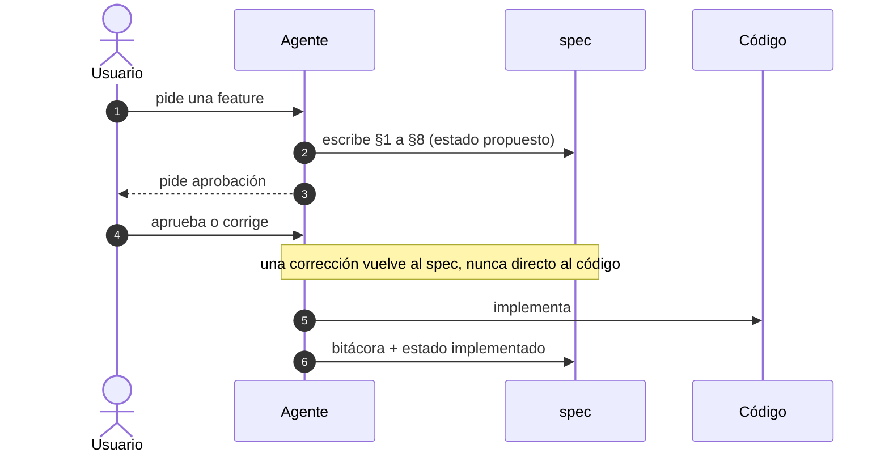
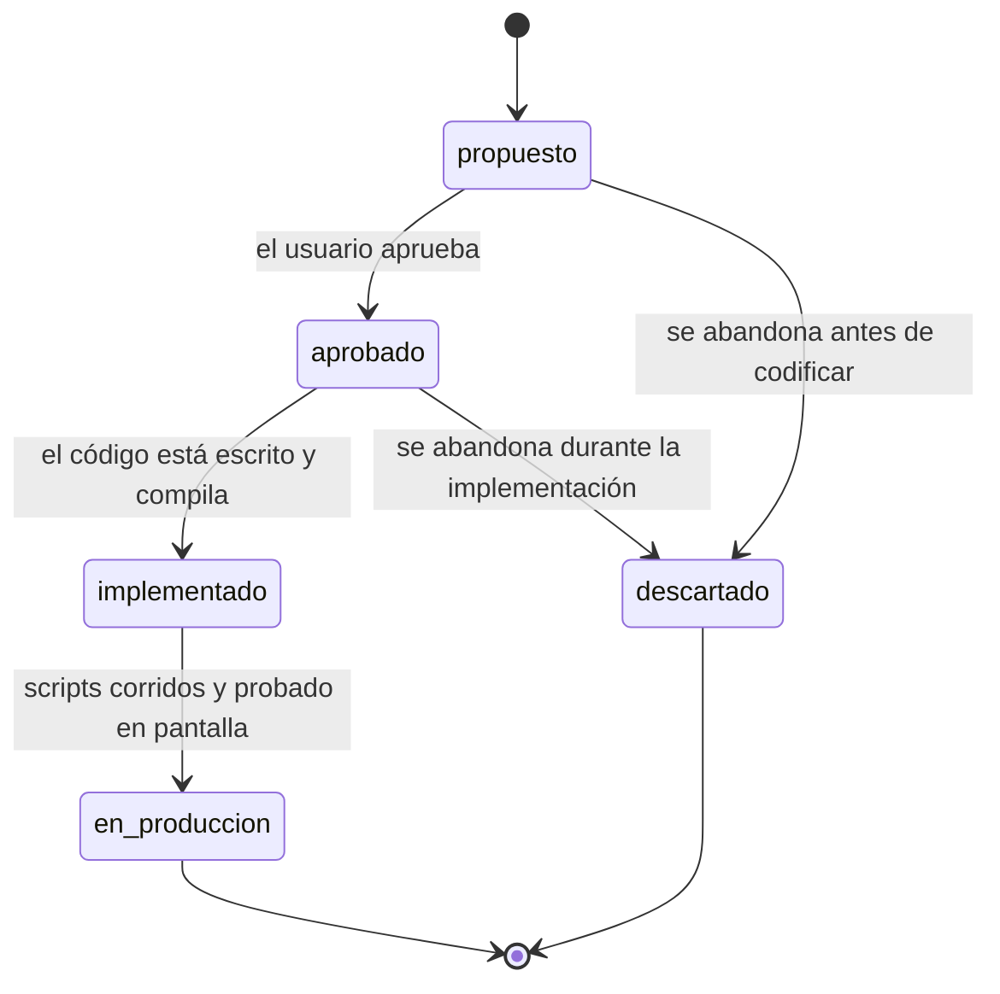

# Formato de los specs

**Hoy:** 24 specs en `specs/`, un archivo cada uno, 8164 líneas, mediana 260. Solo 3
tienen un diagrama. El estado de cada uno es prosa en tres formatos distintos, así que no
se puede grepear. No hay índice: saber qué spec cubre un tema cuesta un grep sobre los 24.

- **Estado:** **implementado.** El formato rige desde el 2026-09-09, `specs/README.md` lo
  indexa, y los specs existentes lo adoptan a medida que se los toca (§10.1).
- **Alcance:** el formato de los documentos de `specs/` — secciones obligatorias,
  diagramas, silogismo y navegación.
- **Fuera de alcance:** reescribir los specs existentes (§10.1 explica por qué no); el
  contenido de ningún spec en particular; el flujo spec → plan → aprobación → código, que
  ya vive en `.claude/agents/atipico.md` y no cambia acá.

---

## 1. Problema

Tres costos concretos, medidos sobre el estado actual:

1. **En un spec grande no se sabe a qué parte saltar.** `numero-pedido.md` tiene 1261
   líneas. Es el único de los 24 que resolvió esto, y lo resolvió solo: una línea
   `**Contenido:** §1–§11 el diseño · §12 el plan · §13 la bitácora` en la cabecera.
   Nadie la planificó y nadie la replicó.
2. **El estado no es dato, es prosa.** Conviven `**Estado:** implementado`,
   `- **Estado:** **propuesto**` y `- **Estado:** implementado.`. No hay forma de listar
   los specs propuestos sin abrirlos uno por uno.
3. **Los diagramas son la excepción.** 3 de 24 usan Mermaid; 7 más tienen dibujos ASCII
   sueltos. El resto explica flujos y máquinas de estado solo con párrafos.

## 2. Silogismo

El apartado de silogismo va sobre la **decisión discutible** del spec, no sobre cada
decisión que contiene. Acá la discutible es si un spec grande se parte en varios archivos.

> **P1.** Nada en el proyecto puede disparar una regla por tamaño: no hay hooks
> configurados —y los hooks viven en `settings.json`, que no se toca—, el CI no mira
> `specs/`, y nadie corre `wc -l` antes de commitear.
>
> **P2.** Partir un spec no reduce contenido: mueve la decisión *"qué parte necesito"* del
> encabezado al sistema de archivos. Esa decisión ya la resuelven `grep` + lectura por
> rango, que funcionan igual sobre un archivo o sobre tres. Y deja dos formas conviviendo,
> que se pagan en cada búsqueda y no una sola vez al migrar.
>
> **∴** Un archivo por spec, siempre. La navegación se resuelve con una línea de
> **Contenido** en la cabecera, no con la estructura de carpetas.
>
> *Si aparece un disparador automático (un hook, un chequeo en CI) o un spec crece hasta
> que `grep` deje de ordenarlo, esta decisión se reabre.*

La última línea es obligatoria: vuelve la decisión falsable. Un silogismo sin condición de
reapertura es una opinión con formato.

## 3. Dónde encaja el formato en el flujo



El formato no cambia el flujo; fija qué tiene que existir en el paso 2 para que el paso 4
sea una aprobación informada y no un acto de fe.

## 4. Estructura obligatoria

### 4.1 Frontmatter

YAML al tope. Lo leen Obsidian (como propiedades), graphify y `grep` por igual.

```yaml
---
estado: propuesto | aprobado | implementado | en-produccion | descartado
ticket: SCRUM-NN          # o "sin ticket" si todavía no existe
actualizado: AAAA-MM-DD
afecta: [sql, Atipico.Api, Atipico.Web]
---
```

`estado` reemplaza la línea `**Estado:**` como dato, y tiene transiciones definidas:



No se salta de `propuesto` a `implementado`: si el código se escribió antes que el spec,
se dice explícitamente en la bitácora y el spec queda como registro de lo hecho.

**`implementado` y `en-produccion` no son lo mismo, y la diferencia es la que más importa
acá.** Este proyecto tiene migraciones SQL numeradas que se corren a mano contra Neon: el
código puede estar escrito, compilando y con pruebas en verde mientras el script todavía
no se ejecutó. Ese estado intermedio es frecuente —`numero-pedido.md` y
`dominio-personalizado-azure.md` están ahí hoy— y aplastarlo contra `implementado` borra
justo el dato que dice si falta trabajo. `en-produccion` significa: corrido contra la base
real y probado en pantalla por el usuario.

### 4.2 Esqueleto

```markdown
# Título

**Hoy:** 2 a 3 líneas. Qué pasa hoy sin esta feature, en el sistema real.
**Contenido:** §1–§6 el diseño · §7 el plan · §8 la bitácora   <- si pasa de 8 secciones

- **Estado:** una línea en prosa, redundante con el frontmatter a propósito.
- **Alcance:** una línea.
- **Fuera de alcance:** una línea.

---

## 1. Problema
## 2. Silogismo
## 3. Decisión              <- lleva el diagrama
## 4. Artefactos
## 5. Reglas de negocio     (si aplica)
## 6. Criterios de aceptación
## 7. Plan de implementación
## 8. Puesta en producción  (si aplica)
## 9. Decisiones abiertas   (si aplica)
## 10. Bitácora

**En pocas palabras:** una o dos frases.
```

### 4.3 Qué es obligatorio

| Sección | Obligatoria | Nota |
|---|---|---|
| Frontmatter | sí | §4.1 |
| **Hoy** | sí | el resumen inicial del estado actual |
| **Contenido** | si pasa de 8 secciones | el mapa; §7 |
| Problema | sí | |
| **Silogismo** | sí | uno, sobre la decisión discutible |
| Decisión + **≥1 diagrama** | sí | tipo según §5 |
| **Artefactos** | sí | tabla, §6 |
| Reglas de negocio | si aplica | cuando toca la base o triggers |
| Criterios de aceptación | sí | verificables, no aspiracionales |
| Plan de implementación | sí | numerado |
| Puesta en producción | si aplica | scripts, secretos, orden |
| Decisiones abiertas | si aplica | se vacía al cerrar |
| Bitácora | sí | descartados · errores · verificado |
| **En pocas palabras** | sí | el cierre |

La numeración se corre si una sección opcional no aplica. No se dejan secciones vacías con
"N/A".

## 5. Diagramas — catálogo

Mínimo uno, en Mermaid (texto plano: lo renderizan Obsidian y GitHub, y se lee sin
renderizar). El tipo lo decide el contenido, no la costumbre:

| Si el spec trata de… | Diagrama |
|---|---|
| un flujo entre Web → API → base o servicio externo | `sequenceDiagram` — **el preferido** |
| una entidad que cambia de estado con reglas | `stateDiagram-v2` |
| tablas, FKs, índices nuevos | `erDiagram` |
| una decisión con ramas | `flowchart` |

**Por qué no siempre secuencia:** un diagrama de secuencia necesita dos actores
intercambiando mensajes. Buena parte de este dominio son máquinas de estado con triggers
que las hacen cumplir (`cuenta`, `pedido`, `pedido_plato`); dibujarlas como secuencia
produce un diagrama que no describe nada. Un diagrama del tipo equivocado es peor que
ninguno, porque se lee como si fuera cierto.

Nada prohíbe más de uno — este spec usa dos, §3 y §4.1.

## 6. Artefactos

Tabla, siempre, con rutas reales — no nombres de proyecto. Es la sección que convierte el
spec en algo ejecutable sin releerlo entero.

| Acción | Ruta | Qué |
|---|---|---|
| nuevo | `sql/016_x.sql` | migración numerada |
| modificado | `Atipico.Api/Controllers/XController.cs` | override de `Update` |
| eliminado | — | |

Hoy la cabecera dice `**Afecta:** sql/, Atipico.Domain, ...`, que informa el proyecto pero
no el archivo. La tabla lo reemplaza.

## 7. Un archivo por spec

`specs/<feature>.md`. Sin excepciones y sin decisión que tomar: no hay umbral de tamaño,
no hay carpetas por feature, no hay dos formas conviviendo. El razonamiento está en §2.

**Lo que reemplaza al corte en archivos es la línea `**Contenido:**`**, obligatoria cuando
el spec pasa de 8 secciones. Va en la cabecera, junto a `**Hoy:**`, y nombra los tramos
por rango de sección:

```
**Contenido:** §1–§11 el diseño · §12 el plan · §13 la bitácora
```

Sirve para las dos formas de leer el documento: quien lo abre en Obsidian ve el mapa antes
del cuerpo, y quien lo lee por rangos sabe qué `offset` pedir sin cargarlo entero. Cuesta
una línea y se escribe en el mismo momento que el spec, que es cuando se sabe.

**Lo que esto no resuelve, y se acepta:** la bitácora crece sin techo y queda dentro del
mismo archivo. Si algún día un spec crece hasta que `grep` deje de ordenarlo, se parte —
pero como decisión explícita de ese spec, conversada, no disparada por un número.

## 8. Artefactos de este spec

| Acción | Ruta | Qué |
|---|---|---|
| nuevo | `specs/formato-spec.md` | este documento |
| nuevo | `specs/README.md` | índice: una línea por spec, con estado y tema |
| modificado | `.claude/agents/atipico.md` | una línea que apunte acá como formato obligatorio |
| — | los specs existentes | **no se tocan** (§10.1) |
| eliminado | — | ninguno |

`.claude/settings.json` no se toca.

**No hay archivo de plantilla suelto.** El esqueleto de §4.2 vive en este spec como bloque
de código: un `_plantilla.md` aparte sería un nodo más en el grafo de graphify y se
desincronizaría de la prosa que lo explica.

## 9. Criterios de aceptación

1. `specs/formato-spec.md` existe y **cumple su propio formato**: frontmatter con `estado`,
   silogismo con cláusula de reapertura, al menos un diagrama Mermaid, tabla de artefactos
   y cierre **En pocas palabras**.
2. `specs/README.md` lista los specs con su estado, y ese estado coincide con lo que
   declara cada archivo.
3. `.claude/agents/atipico.md` apunta a este spec.
4. Los diagramas Mermaid renderizan en Obsidian sin plugins de comunidad.
5. Ningún spec cambió de ruta ni de nombre: todo enlace relativo entre specs sigue
   resolviendo a un archivo que existe, y las citas desde el código siguen siendo válidas.
   *(La primera versión de este criterio traía el patrón de enlace escrito literal como
   ejemplo, y el propio chequeo lo levantó como enlace roto. Los ejemplos de enlaces no se
   escriben con la sintaxis real.)*
6. graphify no necesita reconstrucción completa: ningún nodo existente se mueve, porque
   ningún spec cambió de ruta. *(La puesta al día del grafo quedó fuera de alcance — ver
   fase 4 en §10.)*

## 10. Plan de implementación

**Fase 1 — el formato.** Este documento. Se aprueba antes de seguir.

**Fase 2 — el índice.** Crear `specs/README.md` leyendo el estado declarado de cada spec.
No se inventa estado: si un spec no lo declara, se anota `sin declarar` y se pregunta.

**Fase 3 — el enganche.** Una línea en `.claude/agents/atipico.md` apuntando a
`specs/formato-spec.md`. No se duplica el formato ahí.

**Fase 4 — graphify.** Corre desde la raíz del repo, nunca desde `specs/`: el `cd`
persiste entre llamadas y crea un `graphify-out/` anidado.

**Corregido al ejecutar:** esta fase decía *"entran 2 nodos nuevos, ninguno se mueve"* y
era falso. El grafo es del **2026-09-01** y tiene **10 de los 25 documentos**; faltan 15,
de los cuales 13 no tienen nada que ver con este ticket (`rol-delivery`, `reservas`,
`agente-db`, `mesa-compartida-por-turno`, …). No se puede acotar la actualización a dos
archivos: `--update` detecta todo lo pendiente de una.

Por eso **la puesta al día del grafo sale del alcance de SCRUM-26** y quedó en
[SCRUM-27](https://caverop.atlassian.net/browse/SCRUM-27): son 15 documentos de
extracción semántica —la corrida anterior, de 10 documentos, costó 111k tokens de
entrada— y 13 de ellos son deuda acumulada de otras features, no producto de este cambio.
Mezclarlo acá hace que este ticket cargue un costo que no generó.

*(Cuando se haga: va por la skill `/graphify`, no por `graphify update <path>` del
binario suelto — ese es el modo estructural "sin LLM", que produce nodos superficiales y
los escribe en `specs/graphify-out/` en vez del canónico de la raíz.)*

### 10.1 Por qué no se reescriben los specs existentes

Un retrofit masivo re-extrae el grafo entero, produce un diff enorme que nadie va a
revisar línea por línea, y reescribe la bitácora de features ya cerradas —el único
registro de por qué se decidieron así— sin agregar información. Un spec viejo adopta el
formato cuando se lo toca por otra razón. La convención se propaga por uso, no por
decreto.

## 11. Bitácora

### 11.1 Diseños descartados

- **Carpeta por feature, siempre** (`specs/<feature>/{spec,plan,bitacora}.md`). Era la
  idea original del pedido. Descartada: rompe los 9 enlaces relativos entre specs, las
  citas desde el código —el rename `docs/` → `specs/` costó 55 referencias en 37
  archivos— y todos los ids de nodo de graphify (~202k tokens de reconstrucción), a
  cambio de nada en 19 de 23 casos. Partir `favicon-atipico.md` (78 líneas) en tres
  archivos es estrictamente peor: tres lecturas donde había una.
- **Carpeta por umbral (~400 líneas).** Fue la propuesta intermedia y llegó a estar
  escrita en este spec. Descartada al verificar que **nada puede dispararla**: no hay
  hooks, el CI no mira `specs/`, y los hooks viven en `settings.json`, que este proyecto
  no permite editar. Una regla que nadie puede hacer cumplir es peor que ninguna, porque
  aparenta que el problema está resuelto. Ver §2.
- **El reparto `requirements.md` / `design.md` / `tasks.md`** de Kiro y GitHub Spec Kit.
  Descartado: asume que el spec se descarta después de implementar, y acá es registro
  permanente con bitácora.
- **`_plantilla.md` como archivo suelto.** Descartado en §8: nodo extra en el grafo y
  riesgo de desincronización con la prosa que lo explica.
- **"Siempre un diagrama de secuencia".** Reformulado, no descartado: mínimo un diagrama,
  con catálogo por tipo y la secuencia como preferida donde hay interacción real (§5).

### 11.2 Corregido al implementar

- **Faltaba el estado `en-produccion`.** El vocabulario original era de cuatro estados.
  Al leer los 24 specs para armar el índice (fase 2) aparecieron **8 que declaran "en
  producción"** y varios que dicen literalmente *"implementado — falta correr los scripts
  en la base"*. La distinción ya existía en la práctica y el formato la habría borrado.
  Se agregó como quinto estado en §4.1 antes de escribir el índice, no después.

### 11.3 Fuentes consultadas

- El compendio común de plantillas (RFC, ADR, PRD, Kiro, GitHub Spec Kit) converge en:
  metadatos y estado · problema · decisión · especificación técnica · alternativas
  descartadas · criterios y verificación. La plantilla de §4.2 los cubre todos; lo que
  agrega y no aparece en ninguna es el **silogismo** y la **bitácora**.
- La recomendación general de "carpeta con archivos chicos" se apoya en recuperación por
  embeddings (RAG, *lost in the middle*). Acá no aplica: los specs se leen con `grep` y
  lectura por rango, no por similitud vectorial. Y el grafo de graphify tampoco se afina
  partiendo archivos — sus nodos se extraen semánticamente (123 nodos salieron de 10
  specs), no uno por documento.

### 11.4 Verificado empíricamente (2026-09-09)

- 24 specs, 8152 líneas, mediana 260: `wc -l specs/*.md`.
- 3 specs con Mermaid antes de este cambio, 7 con dibujos ASCII sueltos:
  `grep -c mermaid specs/*.md`.
- 9 enlaces relativos entre specs, cero wikilinks.
- **Un solo spec tiene línea `**Contenido:**`**: `numero-pedido.md`, el más grande. Es la
  evidencia de §1.1 — la navegación apareció sola donde hizo falta, y es lo que §7
  generaliza.
- **No hay hooks configurados** en `.claude/settings*.json`, y ninguno de los dos
  workflows de `.github/workflows/` (`tests.yml`, `azure-dev.yml`) mira `specs/`. Es la
  premisa P1 de §2.
- SCRUM-26 existe, se llama "Mejorar specs", está en *Por hacer* y **no tiene
  descripción** — este spec es su contenido.

### 11.5 Corregido por la auditoría de specs (2026-09-14)

- **Este spec se contradecía a sí mismo sobre su propio estado.** El frontmatter decía
  `estado: implementado` y la línea de prosa de la cabecera seguía diciendo
  `- **Estado:** **propuesto, pendiente de aprobación.** Solo existe este documento.` La
  auditoría (`auditar-specs.ps1`, que extrae el estado desde la prosa con un modelo local)
  leyó el cuerpo, lo comparó contra el índice y reportó `DISCREPA` acá. Corregida la línea a
  **implementado**, y de paso la afirmación vencida de que este documento era el único.
- **La lección es del propio formato, no del spec.** §4.1 dice que el frontmatter *reemplaza*
  la línea de prosa como dato, pero §4.2 deja la línea como redundancia **a propósito** — y un
  dato duplicado puede divergir. Ésta es la primera divergencia registrada entre las dos
  copias, y apareció en el documento que las define. No cambia la decisión (la redundancia
  sirve para leer el archivo sin abrir el frontmatter); sí dice que la auditoría tiene que
  mirar **las dos** y no sólo el frontmatter.

---

**En pocas palabras:** todo spec lleva frontmatter con estado, un resumen de qué pasa hoy,
un silogismo falsable sobre su decisión discutible, al menos un diagrama del tipo que
corresponda, una tabla de artefactos con rutas reales y un cierre en dos frases; un
archivo por spec, siempre, y los que crecen se navegan con una línea de **Contenido** en
la cabecera en vez de partirse en carpetas.
