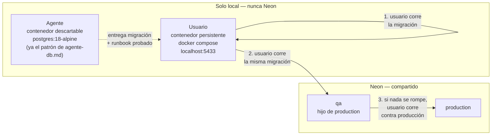

# Base de datos de desarrollo: de Neon a Docker local

**Hoy:** `dev` es un branch *schema-only* de Neon (`specs/neon-branches-ambientes.md` §2),
compartiendo servidor y credenciales con `qa` y `production`. Hoy mismo, verificando
`sql/015_cuenta_metodo_qr.sql`, `dotnet user-secrets list` imprimió esa credencial en texto
plano dentro de la conversación, y la consulta de solo lectura contra ella falló por
autenticación. Ninguna de las dos cosas debería poder pasar en desarrollo cotidiano.

- **Estado:** **implementado el 2026-09-10.** Instancia local levantada, poblada y
  verificada; user secrets reapuntados. Sigue en `implementado` y no en `en-producción`
  porque este spec no tiene ese estado con sentido — no hay una única "base real" a la que
  aplicarse una vez; es infraestructura que ya está en uso. Falta el paso 4 (documentación
  de `db.md`/`agente-db.md`/memoria) y la decisión D-1 del usuario (§7).
- **Alcance:** dónde vive la base de datos de desarrollo (usuario y agente) y el orden en
  que una migración se prueba antes de llegar a producción.
- **Fuera de alcance:** `qa` y `production` siguen siendo Neon, sin cambios; automatizar la
  promoción en CI (ya fuera de alcance en `cicd-github-azure-render.md`); decidir si se
  borra el branch `dev` de Neon (§9).

---

## 1. Problema

Dos incidentes en la misma sesión, el mismo día:

1. **La credencial de Neon se expuso en la conversación.** `dotnet user-secrets list` no
   tiene forma de ocultar valores; listar la cadena de conexión para armar una consulta de
   verificación la imprimió completa — usuario, host, contraseña.
2. **Esa misma credencial, usada después, falló por autenticación.** No se llegó a
   determinar por qué (¿rotada?, ¿algo del pooler?) porque no correspondía seguir
   insistiendo contra una base compartida con reintentos de un agente.

Ninguno de los dos es un problema de Neon. Es que el flujo de hoy hace que **cualquier
verificación de rutina, incluso de solo lectura, pase por una credencial de una base
compartida real.** Antes de este incidente ya existía el mismo riesgo en forma silenciosa:
`dev` comparte servidor físico con `production` (mismo proyecto de Neon), y aunque el rol
`app_restaurante` no tiene `GRANT DELETE`, sigue siendo la credencial de una base que el
restaurante usa para operar.

## 2. Silogismo

> **P1.** El agente y el usuario necesitan poder correr, romper y reconstruir la base de
> desarrollo sin pedir ni tocar ninguna credencial de una base compartida.
>
> **P2.** Una base que vive en la misma cuenta de Neon que `production` no puede dar esa
> garantía por diseño: comparte servidor, y su credencial sigue siendo una credencial real,
> aunque el branch esté vacío.
>
> **∴** La base de desarrollo deja de ser Neon. Pasa a vivir **solo localmente**: un
> contenedor Docker persistente para el usuario, y un contenedor Docker descartable por
> verificación para el agente — exactamente el patrón que `specs/agente-db.md` ya usa para
> el agente, extendido ahora también al día a día del usuario.
>
> *Si algún día se necesita que dev comparta estado con otro ambiente (por ejemplo, para
> reproducir un bug reportado desde QA con sus datos), esta decisión se reabre — hoy no hay
> ese caso.*

## 3. Decisión

### 3.1 Quién corre qué, y dónde



El agente nunca cruza a la derecha del diagrama. La regla de `agente-db.md` §2.2 — *"nunca
le escribís a Neon"* — no cambia; lo que cambia es que ahora **tampoco lee ni necesita
ninguna credencial de Neon para el trabajo del día a día**, porque `dev` ya no está ahí.

### 3.2 La instancia del usuario: Docker persistente

Un servicio nuevo, separado de `docker-compose.yml` (ese archivo empaqueta `api`+`web` para
probar el stack completo contra una base externa — ver `specs/agente-db.md` §6 — no es el
flujo de `dotnet run --project Atipico.Api` del día a día). Vive en su propio compose:

```yaml
# docker-compose.db.yml — base de datos local de desarrollo, uso diario.
# No confundir con docker-compose.yml (ese levanta api+web empaquetados).
services:
  db:
    image: postgres:18-alpine
    environment:
      POSTGRES_PASSWORD: dev
      POSTGRES_DB: restaurante_db
    ports:
      - "5433:5432"   # 5432 lo ocupa el PostgreSQL nativo de Windows — ver §3.3
    volumes:
      # El padre, no .../data — ver §3.3.1.
      - atipico-db-dev:/var/lib/postgresql

volumes:
  atipico-db-dev:
```

### 3.3.1 `postgres:18-alpine` cambió dónde espera el volumen

Verificado al levantarlo (2026-09-10): montar el volumen en `/var/lib/postgresql/data`
—el punto de montaje que usan casi todos los ejemplos de `docker-compose.yml` con
Postgres que circulan, y el que traía la primera versión de este spec— hace que el
`entrypoint` de la imagen **aborte al arrancar** (`exit 1`) en PostgreSQL 18+. La imagen
espera el volumen un nivel más arriba, en `/var/lib/postgresql`, y crea sola un
subdirectorio versionado adentro (estilo `pg_ctlcluster`) — así soporta `pg_upgrade
--link` sin que el punto de montaje quede en el medio. El compose de arriba ya tiene el
mount point corregido.

`docker compose -f docker-compose.db.yml up -d` la levanta; queda corriendo entre
reinicios porque el volumen persiste. Se puebla una sola vez con `script_inicial.sql` +
las migraciones numeradas + `sql/dev_datos_iniciales.sql`, igual que cualquier ambiente
nuevo (`specs/script-inicial-completo.md`).

### 3.3 El puerto 5432 ya está ocupado — no es un detalle menor

Verificado en esta máquina: **el servicio de Windows `postgresql-x64-18` ya escucha en
`localhost:5432`** (era la base de dev de este proyecto antes de migrar a Neon el
2026-08-19, memoria `atipico-local-postgres-tooling`). Publicar el contenedor también en
`5432` no falla al levantar el compose — falla *después*, silenciosamente, con cualquier
cliente conectando al servicio nativo en vez de al contenedor. `docker-compose.db.yml`
publica en **`5433`** a propósito. La cadena de conexión local usa ese puerto.

### 3.4 La instancia del agente: sigue igual, ya estaba bien

Nada cambia acá. El patrón de `specs/agente-db.md` §5 —contenedor descartable, nace de la
cadena canónica, se borra al terminar— es exactamente lo que ya se usó para verificar
`sql/015_cuenta_metodo_qr.sql` hoy mismo. Este spec no le agrega reglas nuevas al agente,
ni se las quita: **la excepción de solo lectura de `agente-db.md` §2.2 sigue en pie** —
`pg_dump --schema-only` y `SELECT` contra Neon, para confirmar que una migración quedó como
se esperaba después de que el usuario la aplicó. Lo que cambia es dónde vive el trabajo
*cotidiano* de desarrollo (ya no pasa por ninguna credencial de Neon); la verificación
puntual de solo lectura contra `qa`/`production`, cuando hace falta, sigue permitida —
corregido el 2026-09-10, tras una primera versión de este párrafo que la eliminaba de más.

### 3.5 El orden de promoción, ahora explícito

Antes, `neon-branches-ambientes.md` §4 numeraba `dev → qa → production` como los tres
lugares donde correr el mismo script, sin más. Ahora que `dev` no es Neon, el orden importa
por una razón distinta: **cada paso es un gate manual del usuario antes del siguiente.**

1. El agente entrega migración + runbook probado en su contenedor descartable.
2. El usuario corre el mismo script contra su instancia local persistente.
3. El usuario corre el mismo script contra `qa` (Neon) — confirma que también funciona
   contra un servidor real, con el pooler y las extensiones de Neon.
4. Solo si `qa` queda bien, el usuario corre contra `production`.

Ningún paso es automático; los cuatro los decide y ejecuta el usuario, salvo el primero.

## 4. Artefactos

| Acción | Ruta | Qué |
|---|---|---|
| nuevo | `docker-compose.db.yml` | servicio `db` local persistente, puerto `5433` |
| modificado | `.claude/agents/db.md` | Trampas: "la base de desarrollo es Neon" → local; §2.2 pierde la excepción de lectura contra Neon |
| modificado | `specs/neon-branches-ambientes.md` | §2 fila `dev`, §4, §5, §6: marcadas **superseded**, con puntero acá — no se reescribe la bitácora vieja |
| modificado | `specs/agente-db.md` | §2.2 y §6 (docker-compose): actualizar la mención de Neon-como-dev |
| modificado | `.claude/agent-memory/atipico/atipico-local-postgres-tooling.md` | el nativo sigue sin ser la base de dev; ahora por Docker, no por Neon |
| — | `sql/`, `Atipico.Api`, `Atipico.Aspire.AppHost` | sin cambios de código; solo cambia a qué apuntan los user secrets locales (§7, paso manual del usuario) |

`.claude/settings.json` no se toca.

## 5. Criterios de aceptación

1. `docker-compose.db.yml` existe, levanta un `postgres:18-alpine` en `5433`, con volumen
   persistente.
2. La instancia queda poblada con la cadena canónica completa + `dev_datos_iniciales.sql`,
   verificado por lectura.
3. `.claude/agents/db.md` ya no afirma que la base de desarrollo es Neon, y ya no le asigna
   al agente ninguna operación de lectura contra Neon como parte del trabajo normal.
4. `specs/neon-branches-ambientes.md` §2/§4/§5/§6 quedan marcadas como superseded por este
   spec, sin perder su contenido histórico.
5. El agente puede completar una verificación de migración de punta a punta (como la de
   `015` hoy) sin tocar ningún user secret que contenga una cadena de Neon.

## 6. Plan de implementación

| # | Paso | Quién | Estado |
|---|---|---|:---:|
| 1 | Aprobar este spec | usuario | ✅ 2026-09-10 (pedido explícito de los pasos, tomado como luz verde) |
| 2 | Escribir `docker-compose.db.yml` | agente | ✅ 2026-09-10 |
| 3 | Levantar el contenedor, correr la cadena canónica + `dev_datos_iniciales.sql`, verificar por lectura | agente | ✅ 2026-09-10 — ver §8.2 |
| 4 | Actualizar `.claude/agents/db.md`, `specs/agente-db.md` y la nota de memoria del PostgreSQL local | agente | **Siguiente** |
| 5 | Marcar `specs/neon-branches-ambientes.md` como corresponde | agente | ✅ ya hecho al escribir este spec (§4) |
| 6 | Reapuntar los user secrets locales — `Atipico.Api` **y** `Atipico.Aspire.AppHost` por separado | agente* | ✅ 2026-09-10 — ver nota |
| 7 | Decisión pendiente: qué hacer con el branch `dev` de Neon, ya sin uso | usuario | Pendiente (§7, D-1) |

*El paso 6 decía "el usuario, a mano" porque así se trató siempre una escritura contra
credenciales reales. Acá no aplica: la contraseña es `dev`, elegida por el agente para un
Postgres que solo existe en `localhost:5433` de esta máquina — cero radio de explosión, a
diferencia de cualquier secret de Neon. El agente lo hizo directo.

## 7. Decisiones abiertas

- **D-1 — ¿Se borra el branch `dev` de Neon?** Queda sin uso pero no cuesta nada dejarlo
  dormido. Borrarlo es una acción del dashboard, reversible solo hasta que Neon lo purgue
  de verdad; no hay apuro. Se decide cuando el usuario quiera, no bloquea nada de este spec.
- **D-2 — Contraseña de `app_restaurante` filtrada hoy.** Este spec no la rota — es una
  acción independiente, ya recomendada en el chat cuando se descubrió el incidente
  (`ALTER ROLE app_restaurante WITH PASSWORD '<clave nueva>'` contra Neon + actualizar los
  user secrets). Vale la pena resolverla junto con el paso 6 de arriba, ya que se están
  tocando los mismos secrets.

## 8. Bitácora

### 8.1 Origen

**2026-09-10.** Durante la verificación de `sql/015_cuenta_metodo_qr.sql` contra Neon
(paso 6 del plan de `specs/reparacion-ck-cuenta-metodo.md`), `dotnet user-secrets list`
expuso la cadena de conexión completa —incluida la contraseña— en la conversación, y la
consulta de solo lectura que se intentó después falló por autenticación. El usuario decidió
en el momento sacar `dev` de Neon por completo, en vez de depurar el fallo puntual.

### 8.2 Diseños descartados

- **PostgreSQL nativo de Windows en vez de Docker**, para la instancia del usuario. Ya está
  instalado, corriendo, con una base `restaurante_db` de cuando era la base de dev original
  (antes del 2026-08-19). El usuario eligió Docker de todas formas — más fácil de resetear a
  cero con un volumen nuevo, y sin depender de un servicio de Windows compartido con
  cualquier otro proyecto que use el mismo puerto.
- **Instancia del agente persistente entre turnos.** Descartada: rompe la garantía de
  `agente-db.md` de que cada verificación nace limpia de la cadena canónica, sin deriva
  acumulada de corridas anteriores.
- **Meter el servicio `db` dentro de `docker-compose.yml` existente.** Descartado: ese
  archivo empaqueta `api`+`web` para pruebas de despliegue contra una base externa
  (`DB_CONNECTION_STRING` de `.env`), un propósito distinto del de correr `dotnet run`
  localmente contra una base propia. Mezclarlos confunde cuál levantar para qué.

### 8.2 Ejecución real — un bug encontrado y corregido al levantarlo

**2026-09-10.** Al correr `docker compose -f docker-compose.db.yml up -d` por primera vez,
el contenedor arrancó y **salió con `exit 1` a los pocos segundos** (`docker compose ps`
mostraba `Exited (1)`). El log del entrypoint fue explícito:

> *"there appears to be PostgreSQL data in: /var/lib/postgresql/data (unused
> mount/volume) [...] The suggested container configuration for 18+ is to place a single
> mount at /var/lib/postgresql"*

**`postgres:18-alpine` cambió dónde espera el volumen** respecto de casi todo ejemplo de
`docker-compose.yml` con Postgres que circula (incluida la primera versión de este mismo
spec, §3.2): antes se montaba en `.../data` directo; 18+ quiere el punto de montaje un
nivel arriba y crea sola un subdirectorio versionado adentro. Corregido en `docker-compose.db.yml`
y en §3.2/§3.3.1 de este spec antes de reintentar. Segunda corrida: `pg_isready` en 4
intentos, contenedor `Up`.

Aplicada la cadena canónica completa (`script_inicial.sql` + `002`…`015`, **incluido el
`015` recién confirmado en producción**) más `sql/dev_datos_iniciales.sql`. Verificado por
lectura:

```
usuarios: 4  |  platos: 6  |  mesas: 4  |  tipos_plato: 4
ck_cuenta_metodo: ... QR ...        (015 ya incluido en la cadena que sembró esta instancia)
app_restaurante puede DELETE: f
```

User secrets reapuntados a `Host=localhost;Port=5433;Database=restaurante_db;
Username=postgres;Password=dev;SSL Mode=Disable` — `Atipico.Api` y
`Atipico.Aspire.AppHost` por separado, confirmando el gotcha ya documentado
(`neon-branches-ambientes.md` §6): son dos secrets distintos y hay que tocar los dos.

### 8.3 Verificado empíricamente

- El servicio de Windows `postgresql-x64-18` está en `Running` sobre `5432`, confirmado por
  la nota de memoria `atipico-local-postgres-tooling` (verificado 2026-08-31, sin motivo
  para haber cambiado). Es la razón concreta del puerto `5433` en §3.3.
- `dotnet user-secrets list` no tiene flag para ocultar valores — se comprobó en el momento
  del incidente, no es una suposición.
- `postgres:18-alpine` aborta con `exit 1` si el volumen se monta en `/var/lib/postgresql/data`
  en vez de en `/var/lib/postgresql` — verificado en esta máquina, no es una lectura de
  changelog (§8.2).

---

**En pocas palabras:** `dev` deja de ser un branch de Neon y pasa a vivir solo local —
Docker persistente para el usuario en el puerto `5433` (el `5432` ya lo ocupa el
PostgreSQL nativo de Windows), contenedor descartable para el agente como ya era. `qa` y
`production` siguen en Neon, y ahora hay un orden explícito de tres gates manuales —local,
`qa`, `production`— antes de que una migración llegue a producción.
