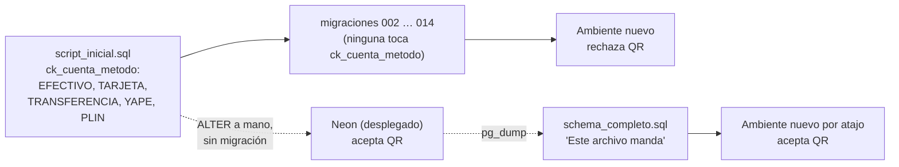

# Reparación de `ck_cuenta_metodo`: la cadena canónica rechaza `QR`

Especificación de la migración `sql/015_cuenta_metodo_qr.sql`. Documento previo a escribir el
script: registra qué se repara, por qué se elige este arreglo y no otro, y cómo se verifica.

- **Estado:** **propuesto, pendiente de aprobación.** No hay script escrito. Nada corrido
  contra ningún contenedor todavía (§7 lo dice explícito).
- **Origen:** hallazgo de la auditoría de `specs/agente-db.md` §5.3–§5.4, que lo dejó fuera de
  su propio alcance por ser un cambio a la base. **Sin ticket de Jira todavía** — hay que
  crearlo antes de aplicar (§8, paso 0).
- **Alcance:** una migración numerada que redefina `ck_cuenta_metodo` para que un ambiente
  construido desde `script_inicial.sql` + las migraciones numeradas acepte `QR`, igual que la
  base desplegada en Neon.
- **Fuera de alcance:**
  - **No se edita `sql/script_inicial.sql`.** Está aplicado; los cambios van en una migración
    nueva. Esa es justamente la regla que el drift violó.
  - **No se toca `MetodoPago.cs`.** El enum ya está donde tiene que estar (§4.2).
  - **No se angosta el `CHECK` a los dos valores del enum.** Es un cambio distinto, con otro
    riesgo y otra aprobación (§4.2).
  - **No se toca ninguna fila.** La migración es puro DDL.
  - **No se regenera `sql/schema_completo.sql` en el mismo acto.** Va después, y con su propia
    confirmación (§9.3).

---

## 1. El problema, en una línea

`sql/script_inicial.sql:200` permite `('EFECTIVO','TARJETA','TRANSFERENCIA','YAPE','PLIN')`.
La base desplegada permite `('EFECTIVO','TARJETA','TRANSFERENCIA','QR')`. **Ninguna migración
registra ese cambio**: alguien lo aplicó a mano contra la base y no lo escribió.

Las dos historias del esquema arrancan del mismo punto y ya no dicen lo mismo:



El repo ya sabía de la diferencia: el encabezado de `schema_completo.sql` (líneas 42-46) la
llama *"DRIFT CONOCIDO"*, `MetodoPago.cs` la comenta, `ModeloEnumsCheckTest.cs` la exceptúa a
propósito y `specs/comprobantes-qr.md` §10 la anotó como riesgo resuelto *en la base
desplegada*. Conocida desde hace tiempo; **reparada, nunca**.

## 2. Por qué no es cosmético

La consecuencia no cae sobre Neon —ahí no pasa nada— sino sobre **cualquier ambiente que nazca
de la vía canónica**: `script_inicial.sql` + migraciones en orden. Ese ambiente queda con un
`CHECK` que rechaza `QR`, y entonces:

- No se puede cobrar una cuenta por QR: el `INSERT`/`UPDATE` de `cuenta.metodo_pago = 'QR'`
  revienta contra el `CHECK`.
- Con eso se cae **toda la feature de comprobantes** (`specs/comprobantes-qr.md`).
  `fn_comprobante_inmutable` (`sql/006:73-77`) rechaza todo comprobante cuya cuenta no sea
  `'QR'`, y las vistas de conciliación `v_cuenta_qr_evidencia_incompleta` (`006`, recreada en
  `007`) filtran por `c.metodo_pago = 'QR'`: quedan mirando filas que no pueden existir.
- El modo de falla es el peor de esta familia: **no falla al desplegar**. El script corre
  limpio, el build pasa, las pruebas pasan. Falla la primera vez que un cajero cobra por QR.

Y el escenario ya está agendado: `specs/neon-branches-ambientes.md` y
`specs/script-inicial-completo.md` apuntan a levantar ramas de Neon para desarrollo y QA. Cada
rama construida desde la cadena nace rota.

## 3. Qué se sabe con certeza, y cómo se supo

Verificado hoy (2026-09-09) por **lectura estática**, sin base — la auditoría enum ↔ `CHECK` no
la necesita:

| Afirmación | Evidencia |
|---|---|
| La cadena no tiene `QR` en el `CHECK` | `sql/script_inicial.sql:198-200` |
| Ninguna migración lo agrega | `grep -rn "metodo_pago\|ck_cuenta_metodo" sql/` → `QR` aparece solo *usado* en `006`/`007`, nunca agregado |
| Lo desplegado sí lo tiene | `sql/schema_completo.sql:421` (`= ANY (ARRAY['EFECTIVO','TARJETA','TRANSFERENCIA','QR'])`) |
| El enum de C# emite `QR` | `Atipico.Domain/Enums/MetodoPago.cs` → `Qr` → `UpperSnakeCaseEnumConverter` → `'QR'` |
| `015` está libre | `sql/` termina en `014_rol_delivery.sql` |

**No verificado todavía** (requiere ejecución, §7): que la cadena completa corra limpia en un
contenedor, que el `INSERT` de `'QR'` efectivamente falle ahí, y qué valores de `metodo_pago`
hay realmente en Neon.

## 4. La decisión: espejar lo desplegado, no angostar

### 4.1 Los tres candidatos

| # | Conjunto resultante | Qué implica |
|---|---|---|
| **A** | `EFECTIVO, TARJETA, TRANSFERENCIA, QR` | La cadena pasa a decir lo que la base ya dice. **Elegida.** |
| B | `EFECTIVO, QR` | Igualdad estricta con `MetodoPago`. Cambia la base real. |
| C | `EFECTIVO, TARJETA, TRANSFERENCIA, YAPE, PLIN, QR` | Unión de las dos historias. |

### 4.2 Por qué A

**Es la que respeta quién manda.** Cuando la cadena y el snapshot se contradicen, la decisión
ya está tomada y escrita: el encabezado de `schema_completo.sql` sentencia *"Este archivo
manda"* para este caso puntual. A ejecuta esa decisión; no la reabre.

**No puede fallar al aplicarse, por construcción.** El conjunto propuesto es *idéntico* al que
Neon ya tiene. `ADD CONSTRAINT` revalida toda la tabla `cuenta`, y ninguna fila puede violar una
restricción equivalente a la que ya estaba vigente. En Neon la migración es un no-op verificable
(§9.2); su valor está en los ambientes que todavía no existen.

**Descartada B (angostar a `EFECTIVO, QR`).** Es tentadora —dejaría el `CHECK` como espejo
exacto del enum y permitiría mover `MetodoPago` al grupo estricto de `ModeloEnumsCheckTest`—
pero:

- Es el único candidato que **puede fallar contra datos reales**: si alguna cuenta histórica
  tiene `TARJETA` o `TRANSFERENCIA`, el `ADD CONSTRAINT` aborta. Hoy no sabemos si las hay
  (§7.3 lo consulta), y averiguarlo no es motivo suficiente para correr el riesgo en la misma
  migración que repara un drift.
- Mezcla dos cambios en uno: *registrar lo que ya existe* y *restringir lo que se permite*. Si
  algo sale mal, no se sabe cuál de los dos fue.
- La holgura es deliberada y está documentada como tal en tres lugares
  (`MetodoPago.cs`, `ModeloEnumsCheckTest.cs`, `schema_completo.sql`). La regla de la casa es
  **subconjunto, no igualdad**: un valor de más en la base es inofensivo, uno de menos rompe
  producción. Angostar no arregla nada; solo achica la holgura.

  Si más adelante se quiere igualdad estricta, es una migración `016` con su propio spec, y su
  primer paso es la consulta de §7.3.

**Descartada C (unión).** Reintroduce `YAPE`/`PLIN`, que no existen en el enum, no existen en la
base y no van a usarse. Es preservar por preservar: agranda el `CHECK` con dos valores muertos
y deja la contradicción documental intacta para el próximo que lea.

### 4.3 Lo que A deja sin resolver, a sabiendas

`script_inicial.sql` va a seguir documentando `YAPE`/`PLIN` en su línea 200, porque no se edita.
Eso es correcto y es cómo funciona una cadena de migraciones: el archivo dice lo que era cierto
cuando se aplicó, y `015` dice lo que es cierto ahora. Quien lea solo `script_inicial.sql` se va
a confundir igual que hoy — por eso `015` lleva en su encabezado el porqué completo, y el
comentario de mantenimiento de `script_inicial.sql` ya advierte que los `CHECK` se cambian con
migraciones nuevas, nunca editándolo.

## 5. La migración

`sql/015_cuenta_metodo_qr.sql`, con el patrón de la casa (`BEGIN`/`COMMIT`, encabezado con el
porqué y el spec, ticket citado). Modelo: `sql/014_rol_delivery.sql`, que hace exactamente esta
forma de cambio sobre `ck_usuario_rol`.

```sql
-- =====================================================================
-- 015_cuenta_metodo_qr.sql — ck_cuenta_metodo pasa a aceptar QR
-- Ver specs/reparacion-ck-cuenta-metodo.md
-- =====================================================================
BEGIN;

-- SCRUM-XX: registra como migracion un cambio que se aplico a mano sobre la base y nunca
-- quedo escrito. La base desplegada acepta QR desde la feature de comprobantes
-- (specs/comprobantes-qr.md); script_inicial.sql todavia documenta YAPE/PLIN, que no
-- existen en ningun lado. Un ambiente construido desde la cadena canonica rechazaba QR y
-- con eso se caia toda la feature de comprobantes: fn_comprobante_inmutable (006) y
-- v_cuenta_qr_evidencia_incompleta (006/007) filtran por metodo_pago = 'QR'.
--
-- No angosta a EFECTIVO/QR (los dos valores de MetodoPago.cs) a proposito: la relacion
-- correcta entre enum y CHECK es subconjunto, no igualdad. Ver el spec, seccion 4.2.
--
-- En Neon esto es un no-op: el conjunto resultante es identico al vigente. El cambio real
-- lo recibe cualquier ambiente nuevo construido desde script_inicial.sql + migraciones.
ALTER TABLE cuenta DROP CONSTRAINT ck_cuenta_metodo;
ALTER TABLE cuenta
    ADD CONSTRAINT ck_cuenta_metodo
    CHECK (metodo_pago IS NULL
        OR metodo_pago IN ('EFECTIVO','TARJETA','TRANSFERENCIA','QR'));

COMMIT;
```

Tres detalles de forma que no son adorno:

- **Se conserva la rama `metodo_pago IS NULL`.** La columna es nullable (`varchar(20)`, sin
  `NOT NULL`) y una cuenta abierta todavía no tiene método. Perderla rompería el flujo normal.
  `ck_cuenta_pago` es la que exige método cuando el estado es `PAGADA`; son restricciones
  distintas y esta migración no la toca.
- **`DROP` + `ADD` planos, no un bloque `DO` condicional.** Además del patrón de la casa, hay
  una razón mecánica: `ModeloEnumsCheckTest` lee el `CHECK` **con una expresión regular sobre el
  texto del archivo** (§6). El DDL literal es lo que la prueba sabe leer.
- **Ningún comentario del archivo debe escribir la secuencia
  `CONSTRAINT ck_cuenta_metodo … CHECK … IN (`** con la lista vieja. La prueba se queda con la
  **primera** coincidencia del archivo; un comentario que cite la forma antigua le haría leer
  los literales equivocados. Por eso el encabezado de arriba nombra los valores en prosa y
  nunca dentro de esa forma sintáctica.

`GRANT` no aplica: no hay objetos nuevos, y una restricción no lleva permisos propios. Los
`GRANT` de `cuenta` para `app_restaurante` no se ven afectados por un `DROP CONSTRAINT`.

## 6. Efecto sobre `ModeloEnumsCheckTest` (y por qué mejora)

`Atipico.Infraestructure.Tests/ModeloEnumsCheckTest.cs` resuelve el valor de cada `CHECK` con un
orden de autoridad explícito:

1. la migración numerada **más alta** que la defina,
2. `schema_completo.sql`,
3. `script_inicial.sql`.

Hoy `ck_cuenta_metodo` no está en ninguna migración, así que la prueba cae al escalón 2 y lee el
snapshot. Con `015` en el repo, `015_cuenta_metodo_qr.sql` ordena por encima de `014` y **pasa a
ser la fuente**. `MetodoPagoEsSubconjuntoDeCkCuentaMetodo` sigue en verde: lee
`EFECTIVO, TARJETA, TRANSFERENCIA, QR`, y `Efectivo`/`Qr` son subconjunto.

Eso es una mejora colateral que vale nombrar: la prueba **deja de depender del snapshot** para
esta restricción. El propio archivo advierte en su comentario `CAVEAT` que apoyarse en
`schema_completo.sql` es frágil, porque el snapshot puede quedar atrás. `015` saca a
`ck_cuenta_metodo` de esa dependencia.

**No se cambia el test.** `MetodoPago` sigue fuera de `EnumsConCheckEstricto()`, porque la
relación sigue siendo subconjunto y no igualdad (§4.2). Sí conviene actualizar el comentario que
explica el drift, que hoy lo describe como *no registrado*: pasa a estar registrado en `015`.

## 7. Verificación

> **Estado: ninguno de estos comandos se ejecutó todavía.** Están redactados a partir del
> patrón que `.claude/agents/db.md` deja verificado (contenedor `postgres:18-alpine`, ~4s hasta
> `pg_isready`), pero el runbook **no se entrega hasta haberlo corrido contra un contenedor
> limpio**. Correrlo es el paso 3 del plan (§8), previo a que el usuario toque Neon.

### 7.1 Reproducir la falla (antes de escribir la migración)

Construir un ambiente por la vía canónica y confirmar que hoy rechaza `QR` — si no falla, la
premisa de todo este spec está mal y hay que revisarla:

```bash
docker run -d --name atipico-015 -e POSTGRES_PASSWORD=probe -e POSTGRES_DB=restaurante_db -P postgres:18-alpine
docker exec atipico-015 pg_isready -U postgres -d restaurante_db
docker exec -i atipico-015 psql -U postgres -d restaurante_db -v ON_ERROR_STOP=1 -q < sql/script_inicial.sql
for f in sql/0*.sql; do docker exec -i atipico-015 psql -U postgres -d restaurante_db -v ON_ERROR_STOP=1 -q < "$f"; done
docker exec atipico-015 psql -U postgres -d restaurante_db -c \
  "SELECT pg_get_constraintdef(oid) FROM pg_constraint WHERE conname = 'ck_cuenta_metodo';"
```

Esperado **antes** de `015`: la definición nombra `YAPE`/`PLIN` y no `QR`.

### 7.2 Confirmar la reparación (después)

Aplicar `015` sobre ese mismo contenedor y verificar las dos direcciones — que `QR` entra y que
un valor inventado sigue rechazándose (una restricción que acepta todo no es una reparación):

```sql
-- ambas dentro de una transacción que se descarta: la verificación no deja datos
BEGIN;
INSERT INTO cuenta (comensal, monto, metodo_pago) VALUES ('probe-qr', 0, 'QR');   -- debe pasar
INSERT INTO cuenta (comensal, monto, metodo_pago) VALUES ('probe-x', 0, 'YAPE');  -- debe fallar
ROLLBACK;
```

*(Las columnas exactas del `INSERT` se ajustan al leer la definición real de `cuenta` al momento
de escribir el script; lo que importa es el par pasa/falla.)*

Y **borrar el contenedor** al terminar: `docker rm -f atipico-015`. Un contenedor viejo con
datos de la corrida anterior es exactamente el modo de fallo que hace inservible esta prueba.

Si Docker no está levantado: se dice y se para. No se sustituye por lectura del código.

### 7.3 Consulta previa contra Neon (solo lectura)

Antes de aplicar, para saber con qué se está tratando — y porque es el dato que decidiría un
futuro angostamiento (§4.2):

```sql
SELECT metodo_pago, count(*) FROM cuenta GROUP BY metodo_pago ORDER BY 1;
```

Esperado: solo `NULL`, `EFECTIVO` y `QR`. Si aparecen `TARJETA` o `TRANSFERENCIA`, **`015` se
aplica igual** —los conserva— pero queda anotado en la bitácora, porque cierra la puerta a B.

## 8. Plan de implementación

| # | Paso | Quién | Estado |
|---|---|---|:---:|
| 0 | Crear el ticket de Jira (proyecto `atipico`) y reemplazar `SCRUM-XX` en el encabezado del script | usuario | Pendiente |
| 1 | Aprobar este spec | usuario | Pendiente |
| 2 | Escribir `sql/015_cuenta_metodo_qr.sql` | agente `db` | Pendiente |
| 3 | Correr §7.1 y §7.2 en contenedor descartable y **pegar la salida real en la bitácora** | agente `db` | Pendiente |
| 4 | Entregar el runbook ya probado + la consulta de verificación posterior | agente `db` | Pendiente |
| 5 | Correr §7.3 y luego `015` contra Neon | **usuario** | Pendiente |
| 6 | Confirmar con la consulta de verificación posterior (§9.2) | usuario | Pendiente |
| 7 | Regenerar `sql/schema_completo.sql` desde Neon | agente `db` | Pendiente |
| 8 | Actualizar los comentarios que describen el drift como no registrado (§9.4) | agente `db` | Pendiente |

Los pasos 2-4 no tocan la base compartida. El paso 5 es el único que escribe en Neon, y **lo
ejecuta el usuario**.

## 9. Despliegue

### 9.1 Aplicar

Una sola transacción, sin ventana de mantenimiento: `DROP` + `ADD CONSTRAINT` toma un
`ACCESS EXCLUSIVE` sobre `cuenta` y revalida la tabla, que a esta escala es instantáneo. No hay
migración de datos, no hay reinicio de la API, no hay cambio de código desplegable asociado.

```
psql "<cadena de Neon, desde user secrets>" -v ON_ERROR_STOP=1 -f sql/015_cuenta_metodo_qr.sql
```

`psql` está en `C:\Program Files\PostgreSQL\18\bin\`, fuera del PATH. La cadena de conexión sale
de user secrets y **no entra a ningún archivo versionado**.

### 9.2 Consulta de verificación posterior

Después de aplicar, el usuario corre:

```sql
SELECT pg_get_constraintdef(oid) FROM pg_constraint WHERE conname = 'ck_cuenta_metodo';
```

Resultado esperado, textual:

```
CHECK (((metodo_pago IS NULL) OR ((metodo_pago)::text = ANY ((ARRAY['EFECTIVO'::character varying, 'TARJETA'::character varying, 'TRANSFERENCIA'::character varying, 'QR'::character varying])::text[]))))
```

Es decir: **idéntico a lo que había antes**. Que no cambie nada es el resultado correcto (§4.2);
lo que cambia es que ahora existe un archivo en `sql/` que lo explica.

### 9.3 Recién después, el snapshot

`sql/schema_completo.sql` se regenera **después** de que el usuario confirme que aplicó, nunca
antes ni a mano. Esa regeneración arrastra además las otras dos diferencias que
`specs/agente-db.md` §5.3 dejó pendientes y que van en la dirección contraria (el snapshot
atrasado respecto de `013` y `014`): los triggers `fn/tg_pedido_mesa_ocupada` que `013` dropeó y
el `DELIVERY` que `014` agregó a `ck_usuario_rol`.

Ojo con el riesgo propio de regenerar: `pg_dump` captura *lo que hay en Neon*, incluido lo que
alguien más haya aplicado a mano. Si al regenerar aparece una diferencia nueva que ninguna
migración explica, **se reporta y se decide; no se absorbe en silencio**. Es el mismo error que
produjo este spec.

### 9.4 Comentarios a corregir después de aplicar

Cuatro lugares describen el drift como *no registrado*. Dejan de ser ciertos con `015` aplicado:

| Archivo | Qué dice hoy |
|---|---|
| `sql/schema_completo.sql` (encabezado, líneas 42-46) | *"no hay migración que registre el cambio"* → ahora la hay; se reescribe al regenerar |
| `Atipico.Domain/Enums/MetodoPago.cs` | Explica el superconjunto citando solo `script_inicial.sql`; agregar la referencia a `015` |
| `Atipico.Infraestructure.Tests/ModeloEnumsCheckTest.cs` | El comentario de precedencia y el de `MetodoPagoEsSubconjuntoDeCkCuentaMetodo` |
| `specs/agente-db.md` §5.4 y la tabla de §5.3 | Marcar el tercer renglón como reparado, apuntando acá |

Son ediciones de comentario, sin efecto en el comportamiento, y van en el mismo commit que la
regeneración del snapshot.

## 10. Criterios de aceptación

- **CA-1** — En una base construida desde `script_inicial.sql` + `002`…`015`,
  `pg_get_constraintdef` de `ck_cuenta_metodo` nombra `EFECTIVO`, `TARJETA`, `TRANSFERENCIA` y
  `QR`, y no nombra `YAPE` ni `PLIN`.
- **CA-2** — En esa misma base, un `INSERT` en `cuenta` con `metodo_pago = 'QR'` tiene éxito.
  Sin `015`, el mismo `INSERT` falla: la prueba tiene que demostrar las dos mitades.
- **CA-3** — En esa misma base, un `INSERT` con `metodo_pago = 'YAPE'` sigue fallando por el
  `CHECK`.
- **CA-4** — Un `INSERT` con `metodo_pago IS NULL` sigue siendo válido (cuenta abierta sin
  método), y `ck_cuenta_pago` sigue exigiendo método cuando el estado es `PAGADA`.
- **CA-5** — `ModeloEnumsCheckTest.MetodoPagoEsSubconjuntoDeCkCuentaMetodo` pasa **leyendo los
  literales desde `sql/015_cuenta_metodo_qr.sql`**, no desde `schema_completo.sql`. Verificable
  quitando temporalmente el snapshot de la lista de archivos, o comprobando que los literales
  leídos son los de `015`.
- **CA-6** — Contra Neon, la definición de la restricción **después** de aplicar es
  byte-idéntica a la de **antes** (§9.2).
- **CA-7** — La suite completa sigue en verde. Si `Atipico.Api` está corriendo, con
  `-c Release`.

CA-1 a CA-4 necesitan PostgreSQL real; hoy no hay proyecto de pruebas de esquema
(`Atipico.Database.Tests` se nombra en `.claude/agents/db.md` pero **no existe** en la solución
— ver §11). Mientras no exista, se verifican a mano con §7 y la salida se pega en la bitácora.

## 11. Bitácora

**2026-09-09 — Origen.** El drift se diagnosticó en la auditoría de `specs/agente-db.md` §5.3,
comparando catálogo normalizado (no diff de texto de `pg_dump`, que dio ~10 falsos positivos
tipográficos contra 3 diferencias reales). Ese spec lo dejó fuera de alcance por ser un cambio a
la base.

**2026-09-09 — Verificación de la premisa antes de escribir este spec.** Releído todo por
lectura estática, sin base: `script_inicial.sql:198-200`, `schema_completo.sql:421`,
`MetodoPago.cs`, `006:73-77` y `006:134`/`007:58`, y `grep` sobre `sql/` confirmando que ninguna
migración define `ck_cuenta_metodo`. La premisa se sostiene. **No se levantó ningún contenedor**:
§7 sigue sin ejecutar y el runbook de §9 está redactado, no probado.

**Diseños descartados.** Angostar a `EFECTIVO, QR` (B) y unir ambas listas (C) — razones en
§4.2. B queda como posible `016` si el usuario quiere igualdad estricta, y su primer paso sería
la consulta de §7.3.

**Hallazgos colaterales, reportados y no arreglados de callado:**

1. **Colisión de numeración con `specs/reservas.md`. — CORREGIDO el 2026-09-09.** Ese spec
   (SCRUM-21, todavía *propuesto*) nombraba su migración como `sql/013_reserva.sql`, pero
   `013` y `014` ya están tomados por `mesa_compartida_por_turno` y `rol_delivery`. Como este
   spec reserva `015`, reservas pasó a **`016`**: ya está cambiado en
   [reservas.md](reservas.md) §4, con la nota de por qué.

   Vale registrar cómo se cerró: el hallazgo estaba acá desde que se escribió este spec,
   *reportado y no arreglado*, y así se habría quedado. Lo que lo desenterró fue el grafo de
   graphify al indexar los dos specs en la misma corrida
   ([SCRUM-27](https://caverop.atlassian.net/browse/SCRUM-27)), que lo levantó como arista
   AMBIGUOUS entre las dos migraciones homónimas. Un hallazgo anotado en un spec que nadie
   vuelve a abrir es un hallazgo perdido; el grafo es lo que lo volvió a poner sobre la mesa.
2. **`Atipico.Database.Tests` no existe.** `.claude/agents/db.md` lo declara entre sus
   responsabilidades y `specs/agente-db.md` lo propone, pero no está en `Atipico.slnx` ni en
   disco. Por eso CA-1…CA-4 se verifican a mano por ahora. No es un bloqueo para `015`.
